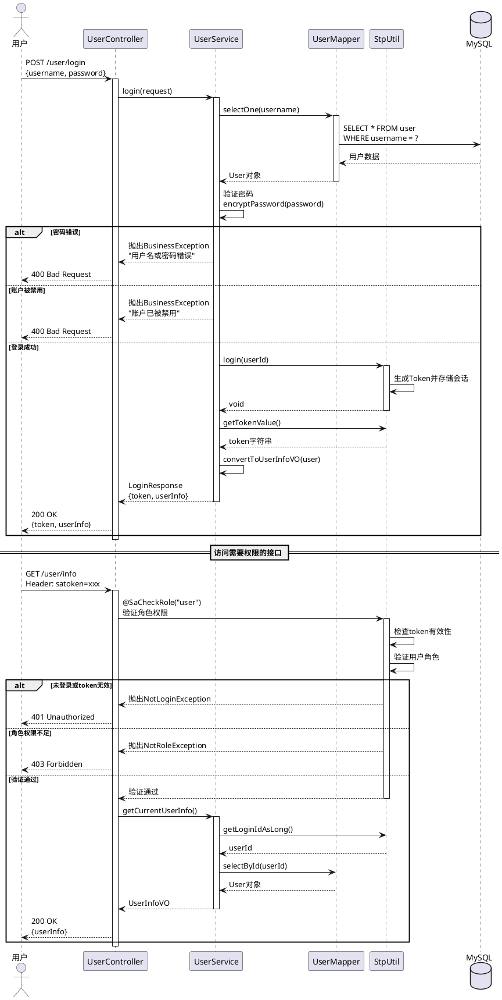
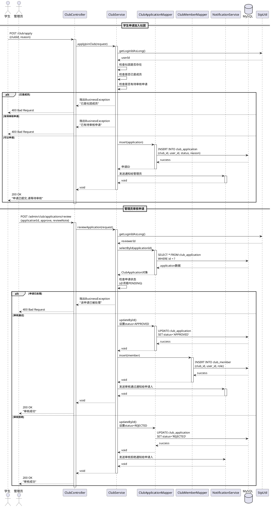
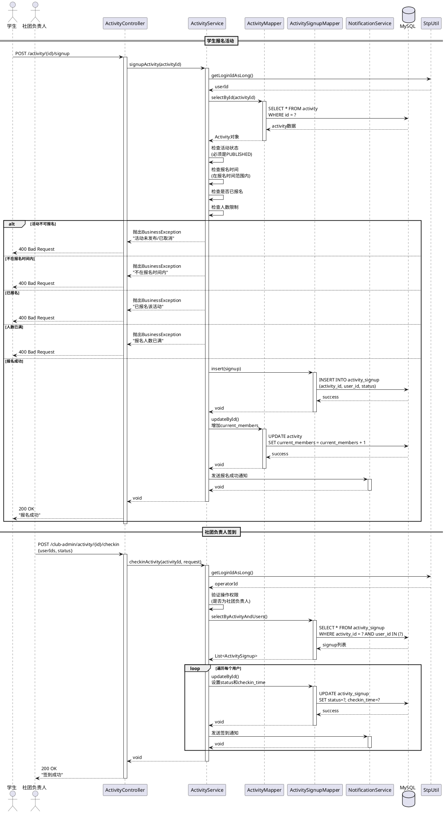
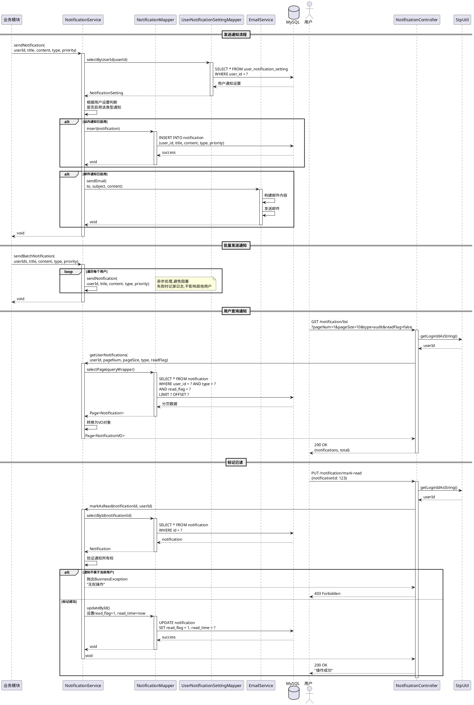

# 5.1 核心功能时序图

### 5.2.1 用户登录与权限验证流程

```plantuml
@startuml 用户登录与权限验证
actor 用户
participant UserController
participant UserService
participant UserMapper
participant StpUtil
database MySQL

用户 -> UserController: POST /user/login\n{username, password}
activate UserController

UserController -> UserService: login(request)
activate UserService

UserService -> UserMapper: selectOne(username)
activate UserMapper
UserMapper -> MySQL: SELECT * FROM user\nWHERE username = ?
MySQL --> UserMapper: 用户数据
UserMapper --> UserService: User对象
deactivate UserMapper

UserService -> UserService: 验证密码\nencryptPassword(password)

alt 密码错误
    UserService --> UserController: 抛出BusinessException\n"用户名或密码错误"
    UserController --> 用户: 400 Bad Request
else 账户被禁用
    UserService --> UserController: 抛出BusinessException\n"账户已被禁用"
    UserController --> 用户: 400 Bad Request
else 登录成功
    UserService -> StpUtil: login(userId)
    activate StpUtil
    StpUtil -> StpUtil: 生成Token并存储会话
    StpUtil --> UserService: void
    deactivate StpUtil

    UserService -> StpUtil: getTokenValue()
    StpUtil --> UserService: token字符串

    UserService -> UserService: convertToUserInfoVO(user)
    UserService --> UserController: LoginResponse\n{token, userInfo}
    deactivate UserService

    UserController --> 用户: 200 OK\n{token, userInfo}
end

deactivate UserController

== 访问需要权限的接口 ==

用户 -> UserController: GET /user/info\nHeader: satoken=xxx
activate UserController

UserController -> StpUtil: @SaCheckRole("user")\n验证角色权限
activate StpUtil
StpUtil -> StpUtil: 检查token有效性
StpUtil -> StpUtil: 验证用户角色

alt 未登录或token无效
    StpUtil --> UserController: 抛出NotLoginException
    UserController --> 用户: 401 Unauthorized
else 角色权限不足
    StpUtil --> UserController: 抛出NotRoleException
    UserController --> 用户: 403 Forbidden
else 验证通过
    StpUtil --> UserController: 验证通过
    deactivate StpUtil

    UserController -> UserService: getCurrentUserInfo()
    activate UserService
    UserService -> StpUtil: getLoginIdAsLong()
    StpUtil --> UserService: userId
    UserService -> UserMapper: selectById(userId)
    UserMapper --> UserService: User对象
    UserService --> UserController: UserInfoVO
    deactivate UserService

    UserController --> 用户: 200 OK\n{userInfo}
end

deactivate UserController
@enduml
```

### 5.2.2 社团申请与审核流程

```plantuml
@startuml 社团申请与审核
actor 学生
actor 管理员
participant ClubController
participant ClubService
participant ClubApplicationMapper
participant ClubMemberMapper
participant NotificationService
database MySQL

== 学生申请加入社团 ==

学生 -> ClubController: POST /club/apply\n{clubId, reason}
activate ClubController

ClubController -> ClubService: applyJoinClub(request)
activate ClubService

ClubService -> StpUtil: getLoginIdAsLong()
StpUtil --> ClubService: userId

ClubService -> ClubService: 检查社团是否存在
ClubService -> ClubService: 检查是否已是成员
ClubService -> ClubService: 检查是否有待审核申请

alt 已是成员
    ClubService --> ClubController: 抛出BusinessException\n"已是社团成员"
    ClubController --> 学生: 400 Bad Request
else 有待审核申请
    ClubService --> ClubController: 抛出BusinessException\n"已有待审核申请"
    ClubController --> 学生: 400 Bad Request
else 可以申请
    ClubService -> ClubApplicationMapper: insert(application)
    activate ClubApplicationMapper
    ClubApplicationMapper -> MySQL: INSERT INTO club_application\n(club_id, user_id, status, reason)
    MySQL --> ClubApplicationMapper: success
    ClubApplicationMapper --> ClubService: 申请ID
    deactivate ClubApplicationMapper

    ClubService -> NotificationService: 发送通知给管理员
    activate NotificationService
    NotificationService --> ClubService: void
    deactivate NotificationService

    ClubService --> ClubController: void
    deactivate ClubService

    ClubController --> 学生: 200 OK\n"申请已提交,请等待审核"
end

deactivate ClubController

== 管理员审核申请 ==

管理员 -> ClubController: POST /admin/club/applications/review\n{applicationId, approve, reviewNote}
activate ClubController

ClubController -> ClubService: reviewApplication(request)
activate ClubService

ClubService -> StpUtil: getLoginIdAsLong()
StpUtil --> ClubService: reviewerId

ClubService -> ClubApplicationMapper: selectById(applicationId)
activate ClubApplicationMapper
ClubApplicationMapper -> MySQL: SELECT * FROM club_application\nWHERE id = ?
MySQL --> ClubApplicationMapper: application数据
ClubApplicationMapper --> ClubService: ClubApplication对象
deactivate ClubApplicationMapper

ClubService -> ClubService: 检查申请状态\n(必须是PENDING)

alt 申请已处理
    ClubService --> ClubController: 抛出BusinessException\n"该申请已被处理"
    ClubController --> 管理员: 400 Bad Request
else 审核通过
    ClubService -> ClubApplicationMapper: updateById()\n设置status=APPROVED
    activate ClubApplicationMapper
    ClubApplicationMapper -> MySQL: UPDATE club_application\nSET status='APPROVED'
    MySQL --> ClubApplicationMapper: success
    ClubApplicationMapper --> ClubService: void
    deactivate ClubApplicationMapper

    ClubService -> ClubMemberMapper: insert(member)
    activate ClubMemberMapper
    ClubMemberMapper -> MySQL: INSERT INTO club_member\n(club_id, user_id, role)
    MySQL --> ClubMemberMapper: success
    ClubMemberMapper --> ClubService: void
    deactivate ClubMemberMapper

    ClubService -> NotificationService: 发送审核通过通知给申请人
    activate NotificationService
    NotificationService --> ClubService: void
    deactivate NotificationService

    ClubService --> ClubController: void
    ClubController --> 管理员: 200 OK\n"审核成功"
else 审核拒绝
    ClubService -> ClubApplicationMapper: updateById()\n设置status=REJECTED
    ClubApplicationMapper -> MySQL: UPDATE club_application\nSET status='REJECTED'
    MySQL --> ClubApplicationMapper: success
    ClubApplicationMapper --> ClubService: void

    ClubService -> NotificationService: 发送审核拒绝通知给申请人
    NotificationService --> ClubService: void
    deactivate NotificationService

    ClubService --> ClubController: void
    deactivate ClubService
    ClubController --> 管理员: 200 OK\n"审核成功"
end

deactivate ClubController
@enduml
```

### 5.2.3 活动报名与签到流程

```plantuml
@startuml 活动报名与签到
actor 学生
actor 社团负责人
participant ActivityController
participant ActivityService
participant ActivityMapper
participant ActivitySignupMapper
participant NotificationService
database MySQL

== 学生报名活动 ==

学生 -> ActivityController: POST /activity/{id}/signup
activate ActivityController

ActivityController -> ActivityService: signupActivity(activityId)
activate ActivityService

ActivityService -> StpUtil: getLoginIdAsLong()
StpUtil --> ActivityService: userId

ActivityService -> ActivityMapper: selectById(activityId)
activate ActivityMapper
ActivityMapper -> MySQL: SELECT * FROM activity\nWHERE id = ?
MySQL --> ActivityMapper: activity数据
ActivityMapper --> ActivityService: Activity对象
deactivate ActivityMapper

ActivityService -> ActivityService: 检查活动状态\n(必须是PUBLISHED)
ActivityService -> ActivityService: 检查报名时间\n(在报名时间范围内)
ActivityService -> ActivityService: 检查是否已报名
ActivityService -> ActivityService: 检查人数限制

alt 活动不可报名
    ActivityService --> ActivityController: 抛出BusinessException\n"活动未发布/已取消"
    ActivityController --> 学生: 400 Bad Request
else 不在报名时间内
    ActivityService --> ActivityController: 抛出BusinessException\n"不在报名时间内"
    ActivityController --> 学生: 400 Bad Request
else 已报名
    ActivityService --> ActivityController: 抛出BusinessException\n"已报名该活动"
    ActivityController --> 学生: 400 Bad Request
else 人数已满
    ActivityService --> ActivityController: 抛出BusinessException\n"报名人数已满"
    ActivityController --> 学生: 400 Bad Request
else 报名成功
    ActivityService -> ActivitySignupMapper: insert(signup)
    activate ActivitySignupMapper
    ActivitySignupMapper -> MySQL: INSERT INTO activity_signup\n(activity_id, user_id, status)
    MySQL --> ActivitySignupMapper: success
    ActivitySignupMapper --> ActivityService: void
    deactivate ActivitySignupMapper

    ActivityService -> ActivityMapper: updateById()\n增加current_members
    activate ActivityMapper
    ActivityMapper -> MySQL: UPDATE activity\nSET current_members = current_members + 1
    MySQL --> ActivityMapper: success
    ActivityMapper --> ActivityService: void
    deactivate ActivityMapper

    ActivityService -> NotificationService: 发送报名成功通知
    activate NotificationService
    NotificationService --> ActivityService: void
    deactivate NotificationService

    ActivityService --> ActivityController: void
    deactivate ActivityService

    ActivityController --> 学生: 200 OK\n"报名成功"
end

deactivate ActivityController

== 社团负责人签到 ==

社团负责人 -> ActivityController: POST /club-admin/activity/{id}/checkin\n{userIds, status}
activate ActivityController

ActivityController -> ActivityService: checkinActivity(activityId, request)
activate ActivityService

ActivityService -> StpUtil: getLoginIdAsLong()
StpUtil --> ActivityService: operatorId

ActivityService -> ActivityService: 验证操作权限\n(是否为社团负责人)

ActivityService -> ActivitySignupMapper: selectByActivityAndUsers()
activate ActivitySignupMapper
ActivitySignupMapper -> MySQL: SELECT * FROM activity_signup\nWHERE activity_id = ? AND user_id IN (?)
MySQL --> ActivitySignupMapper: signup列表
ActivitySignupMapper --> ActivityService: List<ActivitySignup>
deactivate ActivitySignupMapper

loop 遍历每个用户
    ActivityService -> ActivitySignupMapper: updateById()\n设置status和checkin_time
    activate ActivitySignupMapper
    ActivitySignupMapper -> MySQL: UPDATE activity_signup\nSET status=?, checkin_time=?
    MySQL --> ActivitySignupMapper: success
    ActivitySignupMapper --> ActivityService: void
    deactivate ActivitySignupMapper

    ActivityService -> NotificationService: 发送签到通知
    activate NotificationService
    NotificationService --> ActivityService: void
    deactivate NotificationService
end

ActivityService --> ActivityController: void
deactivate ActivityService

ActivityController --> 社团负责人: 200 OK\n"签到成功"
deactivate ActivityController
@enduml
```

### 5.2.4 通知系统流程

```plantuml
@startuml 通知系统
participant 业务模块
participant NotificationService
participant NotificationMapper
participant UserNotificationSettingMapper
participant EmailService
database MySQL

== 发送通知流程 ==

业务模块 -> NotificationService: sendNotification(\nuserId, title, content, type, priority)
activate NotificationService

NotificationService -> UserNotificationSettingMapper: selectByUserId(userId)
activate UserNotificationSettingMapper
UserNotificationSettingMapper -> MySQL: SELECT * FROM user_notification_setting\nWHERE user_id = ?
MySQL --> UserNotificationSettingMapper: 用户通知设置
UserNotificationSettingMapper --> NotificationService: NotificationSetting
deactivate UserNotificationSettingMapper

NotificationService -> NotificationService: 根据用户设置判断\n是否启用该类型通知

alt 站内通知已启用
    NotificationService -> NotificationMapper: insert(notification)
    activate NotificationMapper
    NotificationMapper -> MySQL: INSERT INTO notification\n(user_id, title, content, type, priority)
    MySQL --> NotificationMapper: success
    NotificationMapper --> NotificationService: void
    deactivate NotificationMapper
end

alt 邮件通知已启用
    NotificationService -> EmailService: sendEmail(\nto, subject, content)
    activate EmailService
    EmailService -> EmailService: 构建邮件内容
    EmailService -> EmailService: 发送邮件
    EmailService --> NotificationService: void
    deactivate EmailService
end

NotificationService --> 业务模块: void
deactivate NotificationService

== 批量发送通知 ==

业务模块 -> NotificationService: sendBatchNotification(\nuserIds, title, content, type, priority)
activate NotificationService

loop 遍历每个用户
    NotificationService -> NotificationService: sendNotification(\nuserId, title, content, type, priority)

    note right
        异步处理,避免阻塞
        失败时记录日志,不影响其他用户
    end note
end

NotificationService --> 业务模块: void
deactivate NotificationService

== 用户查询通知 ==

actor 用户
participant NotificationController

用户 -> NotificationController: GET /notification/list\n?pageNum=1&pageSize=10&type=audit&readFlag=false
activate NotificationController

NotificationController -> StpUtil: getLoginIdAsString()
StpUtil --> NotificationController: userId

NotificationController -> NotificationService: getUserNotifications(\nuserId, pageNum, pageSize, type, readFlag)
activate NotificationService

NotificationService -> NotificationMapper: selectPage(queryWrapper)
activate NotificationMapper
NotificationMapper -> MySQL: SELECT * FROM notification\nWHERE user_id = ? AND type = ?\nAND read_flag = ?\nLIMIT ? OFFSET ?
MySQL --> NotificationMapper: 分页数据
NotificationMapper --> NotificationService: Page<Notification>
deactivate NotificationMapper

NotificationService -> NotificationService: 转换为VO对象
NotificationService --> NotificationController: Page<NotificationVO>
deactivate NotificationService

NotificationController --> 用户: 200 OK\n{notifications, total}
deactivate NotificationController

== 标记已读 ==

用户 -> NotificationController: PUT /notification/mark-read\n{notificationId: 123}
activate NotificationController

NotificationController -> StpUtil: getLoginIdAsString()
StpUtil --> NotificationController: userId

NotificationController -> NotificationService: markAsRead(notificationId, userId)
activate NotificationService

NotificationService -> NotificationMapper: selectById(notificationId)
activate NotificationMapper
NotificationMapper -> MySQL: SELECT * FROM notification\nWHERE id = ?
MySQL --> NotificationMapper: notification
NotificationMapper --> NotificationService: Notification
deactivate NotificationMapper

NotificationService -> NotificationService: 验证通知所有权

alt 通知不属于当前用户
    NotificationService --> NotificationController: 抛出BusinessException\n"无权操作"
    NotificationController --> 用户: 403 Forbidden
else 标记成功
    NotificationService -> NotificationMapper: updateById()\n设置read_flag=1, read_time=now
    activate NotificationMapper
    NotificationMapper -> MySQL: UPDATE notification\nSET read_flag = 1, read_time = ?
    MySQL --> NotificationMapper: success
    NotificationMapper --> NotificationService: void
    deactivate NotificationMapper

    NotificationService --> NotificationController: void
    deactivate NotificationService

    NotificationController --> 用户: 200 OK\n"操作成功"
end

deactivate NotificationController
@enduml
```
