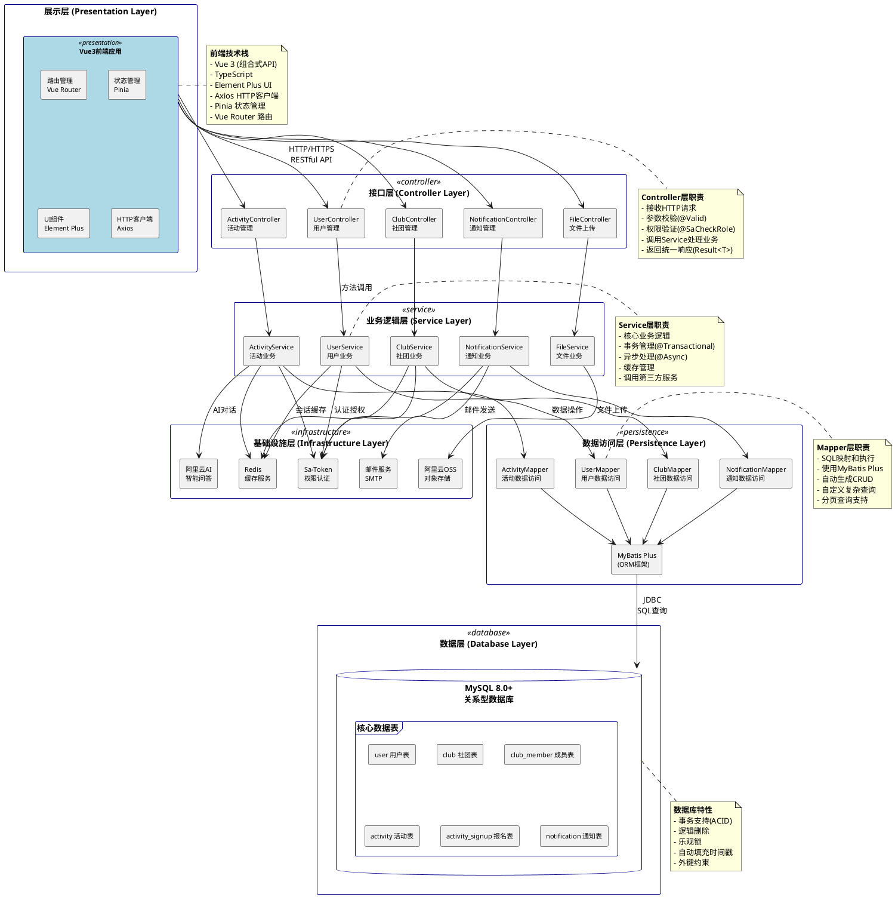
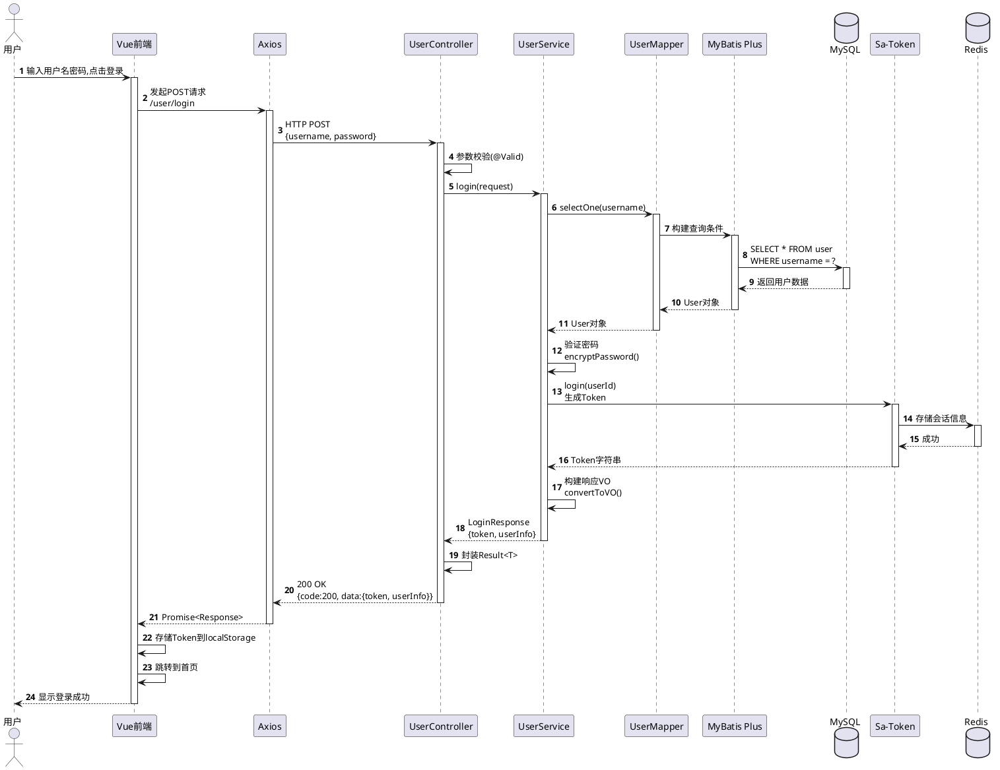
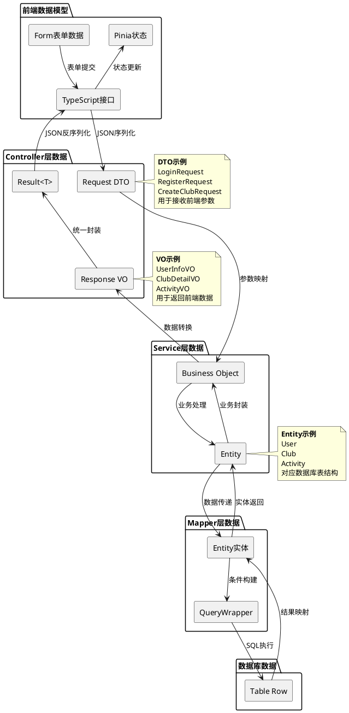

# 5.4 系统架构图

## 系统分层架构

本系统采用经典的MVC三层架构模式，前后端分离设计，通过RESTful API进行通信。

### 整体架构图



### 架构说明

#### 1. **展示层 (Presentation Layer)**
- **技术栈**: Vue 3 + TypeScript + Element Plus
- **主要职责**:
  - 用户界面渲染
  - 用户交互处理
  - 状态管理(Pinia)
  - 路由导航(Vue Router)
  - HTTP请求发送(Axios)
- **通信方式**: 通过RESTful API与后端通信
- **数据格式**: JSON

#### 2. **接口层 (Controller Layer)**
- **技术栈**: Spring MVC + SpringDoc OpenAPI
- **主要职责**:
  - 定义RESTful API端点
  - 接收并验证请求参数(@Valid)
  - 权限验证(@SaCheckRole, @SaCheckLogin)
  - 调用Service层处理业务
  - 封装统一响应格式(Result<T>)
- **注解使用**:
  ```java
  @RestController
  @RequestMapping("/user")
  @RequiredArgsConstructor
  @Tag(name = "用户管理")
  public class UserController {
      @GetMapping("/info")
      @SaCheckRole("user")
      public Result<UserInfoVO> getUserInfo() { }
  }
  ```

#### 3. **业务逻辑层 (Service Layer)**
- **技术栈**: Spring + Sa-Token + Spring Cache
- **主要职责**:
  - 实现核心业务逻辑
  - 事务管理(@Transactional)
  - 数据转换(Entity ↔ VO/DTO)
  - 业务规则验证
  - 调用第三方服务
  - 异步任务处理(@Async)
- **设计模式**:
  - 接口与实现分离
  - 依赖注入(构造器注入)
  - 策略模式(不同审核策略)
- **示例代码**:
  ```java
  @Service
  @RequiredArgsConstructor
  @Slf4j
  public class UserServiceImpl extends ServiceImpl<UserMapper, User> implements UserService {
      @Override
      @Transactional(rollbackFor = Exception.class)
      public LoginResponse login(LoginRequest request) {
          // 业务逻辑实现
      }
  }
  ```

#### 4. **数据访问层 (Persistence Layer)**
- **技术栈**: MyBatis Plus 3.5.9
- **主要职责**:
  - SQL映射与执行
  - 数据库CRUD操作
  - 复杂查询构建
  - 分页查询支持
  - 批量操作优化
- **MyBatis Plus特性**:
  - 自动生成CRUD方法
  - LambdaQueryWrapper条件构造
  - 分页插件
  - 逻辑删除
  - 自动填充
- **示例代码**:
  ```java
  @Mapper
  public interface UserMapper extends BaseMapper<User> {
      // 继承BaseMapper获得基础CRUD方法
      // 可自定义复杂查询
  }
  ```

#### 5. **数据层 (Database Layer)**
- **技术**: MySQL 8.0+ (微信云托管)
- **核心数据表**:
  - user: 用户信息
  - club: 社团信息
  - club_member: 社团成员关系
  - club_application: 社团申请
  - activity: 活动信息
  - activity_signup: 活动报名
  - notification: 通知消息
  - user_notification_setting: 通知设置
- **特性**:
  - InnoDB存储引擎
  - 事务支持(ACID)
  - 外键约束
  - 索引优化
  - 逻辑删除(is_deleted)
  - 时间戳自动更新

#### 6. **基础设施层 (Infrastructure Layer)**
包含系统运行所需的各种基础服务:

- **Sa-Token (权限认证)**:
  - 用户登录状态管理
  - Token生成与验证
  - 角色权限验证
  - Session管理

- **Redis (缓存服务)**:
  - Token缓存存储
  - 权限信息缓存
  - 热点数据缓存
  - 分布式锁

- **阿里云OSS (对象存储)**:
  - 图片文件存储
  - 文件上传下载
  - CDN加速

- **邮件服务 (SMTP)**:
  - 系统通知邮件
  - 异步发送

- **阿里云AI**:
  - 智能问答
  - 自然语言处理

---

## 请求处理流程

以"用户登录"为例,展示完整的请求处理流程:



### 流程说明

1. **用户操作**: 用户在前端页面输入用户名密码
2. **前端处理**: Vue组件调用Axios发送HTTP请求
3. **Controller接收**:
   - 接收请求参数
   - 使用@Valid进行参数校验
   - 调用Service层处理
4. **Service处理**:
   - 调用Mapper查询用户
   - 验证密码是否正确
   - 调用Sa-Token生成Token
   - 构建响应VO对象
5. **Mapper查询**:
   - 使用MyBatis Plus构建查询
   - 执行SQL查询
   - 返回实体对象
6. **数据库操作**:
   - 执行SELECT查询
   - 返回结果集
7. **Token管理**:
   - Sa-Token生成Token
   - Redis存储会话信息
8. **响应返回**:
   - Service返回LoginResponse
   - Controller封装Result<T>
   - Axios接收响应
   - Vue存储Token并跳转

---

## 数据流转图

展示数据在各层之间的转换关系:



### 数据转换说明

#### 1. **请求方向 (前端 → 数据库)**
- **Form表单数据** → **TypeScript接口**: 表单验证和类型检查
- **TypeScript接口** → **Request DTO**: Axios序列化为JSON
- **Request DTO** → **Business Object**: Controller层参数映射
- **Business Object** → **Entity**: Service层业务处理
- **Entity** → **QueryWrapper**: Mapper层构建查询条件
- **QueryWrapper** → **Table Row**: MyBatis执行SQL

#### 2. **响应方向 (数据库 → 前端)**
- **Table Row** → **Entity**: MyBatis结果映射
- **Entity** → **Business Object**: Service层业务封装
- **Business Object** → **Response VO**: 数据转换和脱敏
- **Response VO** → **Result<T>**: Controller统一响应封装
- **Result<T>** → **TypeScript接口**: Axios反序列化
- **TypeScript接口** → **Pinia状态**: 状态管理存储

#### 3. **数据对象类型**

**DTO (Data Transfer Object)**:
```java
@Data
public class LoginRequest {
    @NotBlank(message = "用户名不能为空")
    private String username;

    @NotBlank(message = "密码不能为空")
    private String password;
}
```

**VO (View Object)**:
```java
@Data
public class UserInfoVO {
    private Long id;
    private String username;
    private String realName;
    private String email;
    private String avatar;
    // 不包含password等敏感信息
}
```

**Entity (数据库实体)**:
```java
@Data
@TableName("user")
public class User {
    @TableId(type = IdType.AUTO)
    private Long id;
    private String username;
    private String password; // 加密后的密码
    private String realName;
    private String email;
    // ... 对应数据库字段
}
```

---

## 架构优势

### 1. **分层解耦**
- 各层职责明确,互不干扰
- 易于维护和扩展
- 支持独立测试

### 2. **前后端分离**
- 前端专注UI交互
- 后端专注业务逻辑
- 通过API协议通信
- 支持多端适配

### 3. **技术选型合理**
- Spring Boot生态成熟
- MyBatis Plus提高开发效率
- Sa-Token轻量级权限框架
- Redis缓存提升性能

### 4. **扩展性强**
- 易于添加新功能模块
- 支持水平扩展
- 支持微服务改造

### 5. **安全性高**
- 多层权限验证
- 数据脱敏处理
- SQL注入防护
- XSS攻击防护
