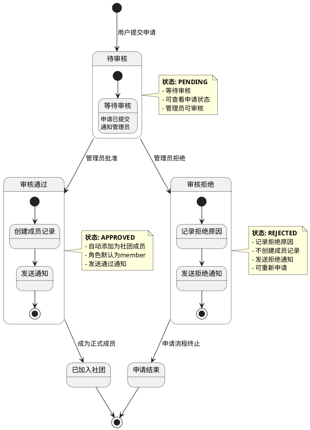
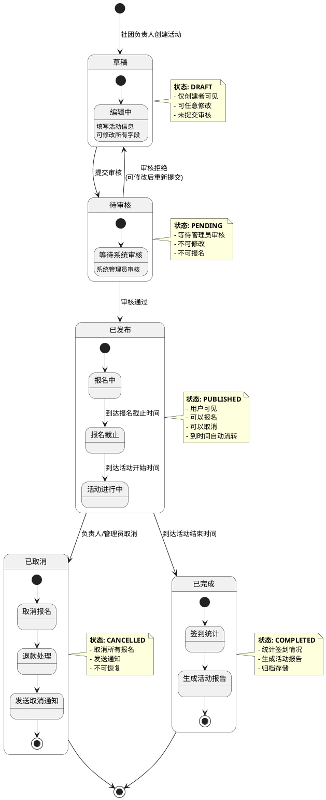
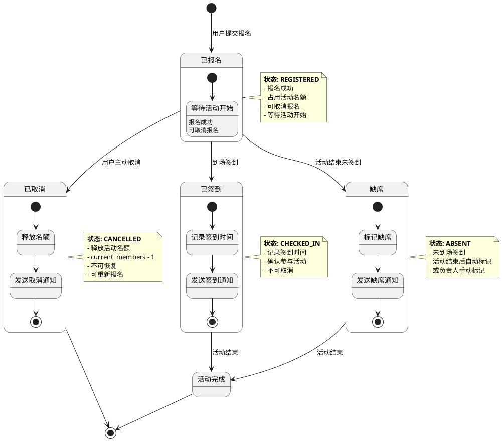
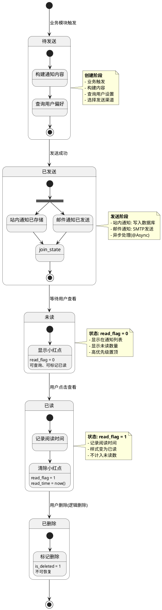
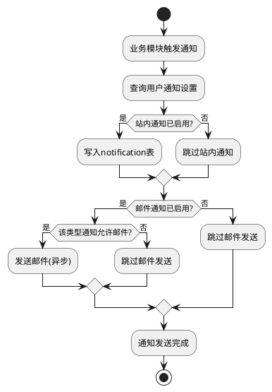
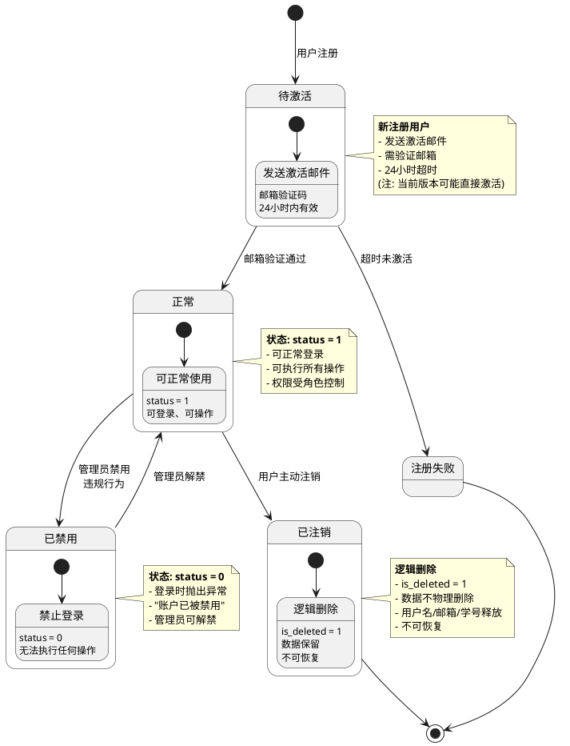
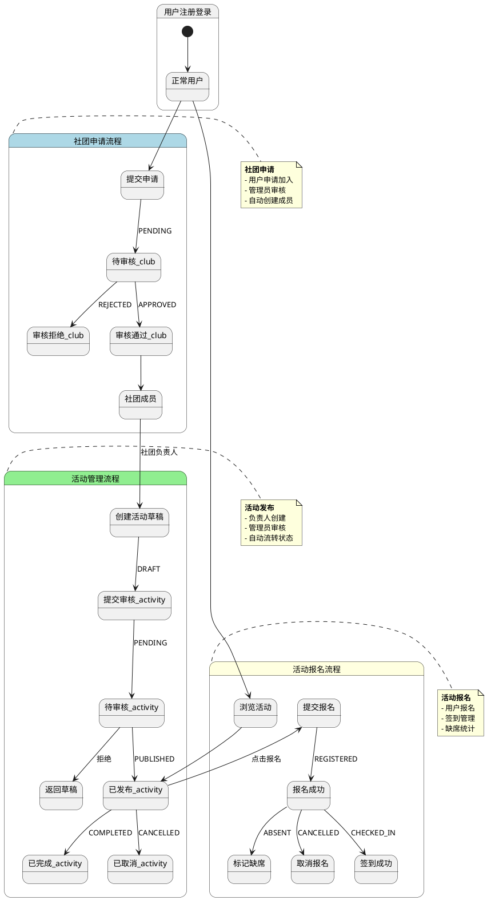

# 5.5 核心功能状态图

状态图用于描述对象在其生命周期内的状态变化和状态转换条件，能够清晰地展示业务流程的各个阶段。

## 1. 社团申请状态图

社团申请从提交到最终结果的完整状态流转过程。



### 状态说明

| 状态 | 枚举值 | 说明 | 可执行操作 |
|------|--------|------|------------|
| 待审核 | PENDING | 申请已提交，等待管理员审核 | 管理员可审核、用户可查看 |
| 审核通过 | APPROVED | 管理员批准申请 | 自动创建成员记录、发送通知 |
| 审核拒绝 | REJECTED | 管理员拒绝申请 | 记录原因、发送通知、允许重新申请 |
| 已加入社团 | - | 成为正式社团成员 | 参与社团活动、查看社团信息 |

### 状态转换条件

- **待审核 → 审核通过**: 管理员执行批准操作 + 社团状态正常
- **待审核 → 审核拒绝**: 管理员执行拒绝操作
- **审核通过 → 已加入社团**: 成员记录创建成功
- **审核拒绝 → 申请结束**: 拒绝通知发送完成

---

## 2. 活动状态图

活动从创建到完成的完整生命周期状态流转。



### 状态说明

| 状态 | 枚举值 | 说明 | 可执行操作 |
|------|--------|------|------------|
| 草稿 | DRAFT | 活动创建中，未提交 | 编辑、删除、提交审核 |
| 待审核 | PENDING | 已提交，等待审核 | 管理员审核(通过/拒绝) |
| 已发布 | PUBLISHED | 审核通过，对外发布 | 报名、取消报名、签到、取消活动 |
| 已取消 | CANCELLED | 活动被取消 | 查看、导出数据 |
| 已完成 | COMPLETED | 活动已结束 | 查看、统计、导出报告 |

### 状态转换条件

- **草稿 → 待审核**: 社团负责人提交审核 + 活动信息完整
- **待审核 → 已发布**: 系统管理员审核通过
- **待审核 → 草稿**: 系统管理员审核拒绝
- **已发布 → 已取消**: 负责人或管理员主动取消
- **已发布 → 已完成**: 活动结束时间到达 + 系统自动流转

### 子状态说明

**已发布状态的子状态**:
- **报名中**: 当前时间在报名开始和截止时间之间
- **报名截止**: 超过报名截止时间，不可再报名
- **活动进行中**: 活动开始时间已到，可以签到

---

## 3. 活动报名状态图

用户报名活动后的状态流转过程。



### 状态说明

| 状态 | 枚举值 | 说明 | 可执行操作 |
|------|--------|------|------------|
| 已报名 | REGISTERED | 报名成功，等待活动 | 取消报名、等待签到 |
| 已取消 | CANCELLED | 用户取消报名 | 释放名额、可重新报名 |
| 已签到 | CHECKED_IN | 用户已签到 | 无(等待活动结束) |
| 缺席 | ABSENT | 未签到，被标记缺席 | 无(记录缺席) |

### 状态转换条件

- **已报名 → 已取消**: 用户主动取消 + 在取消截止时间前
- **已报名 → 已签到**: 负责人扫码签到 + 活动进行中
- **已报名 → 缺席**: 活动结束时未签到 OR 负责人手动标记

### 业务规则

1. **取消报名限制**:
   - 活动开始前可取消
   - 活动开始后不可取消
   - 已签到状态不可取消

2. **名额管理**:
   - 报名成功: `current_members + 1`
   - 取消报名: `current_members - 1`
   - 达到上限不可报名

3. **签到规则**:
   - 只能在活动进行中签到
   - 签到后状态不可逆
   - 支持批量签到

---

## 4. 通知状态图

系统通知从创建到已读的状态流转。



### 状态说明

| 状态 | 字段值 | 说明 | 可执行操作 |
|------|--------|------|------------|
| 待发送 | - | 通知创建中 | 内部处理 |
| 已发送 | - | 发送完成 | 内部处理 |
| 未读 | read_flag = 0 | 等待用户查看 | 标记已读、删除 |
| 已读 | read_flag = 1 | 用户已查看 | 删除 |
| 已删除 | is_deleted = 1 | 逻辑删除 | 无 |

### 通知类型与优先级

**通知类型** (type字段):
- `system`: 系统通知
- `audit`: 审核消息(申请结果)
- `activity`: 活动提醒(报名、签到、取消)
- `club`: 社团通知(新公告、成员变更)

**优先级** (priority字段):
- 0: 低优先级(普通通知)
- 1: 普通优先级(默认)
- 2: 高优先级(重要提醒)
- 3: 紧急优先级(需立即处理)

### 发送渠道选择逻辑



---

## 5. 用户账户状态图

用户账户从注册到禁用的状态管理。



### 状态说明

| 状态 | 字段值 | 说明 | 可执行操作 |
|------|--------|------|------------|
| 待激活 | - | 新注册，待验证 | 邮箱验证 |
| 正常 | status = 1 | 正常使用 | 所有操作 |
| 已禁用 | status = 0 | 被管理员禁用 | 无(等待解禁) |
| 已注销 | is_deleted = 1 | 用户注销 | 无 |

### 状态转换条件

- **待激活 → 正常**: 邮箱验证通过(或系统配置直接激活)
- **正常 → 已禁用**: 管理员操作 + 禁用原因
- **已禁用 → 正常**: 管理员解禁操作
- **正常 → 已注销**: 用户主动注销 + 二次确认

---

## 6. 综合状态流转图

展示社团申请、活动报名的完整业务流程状态关系。



---

## 状态机设计总结

### 1. 设计原则

- **单一职责**: 每个状态只负责一个业务阶段
- **状态完备**: 覆盖所有可能的业务场景
- **转换明确**: 每个状态转换都有明确的触发条件
- **可追溯**: 记录状态变更时间和操作人

### 2. 实现方式

**枚举类定义**:
```java
public enum ApplicationStatus {
    PENDING("待审核"),
    APPROVED("审核通过"),
    REJECTED("审核拒绝");

    private final String description;

    ApplicationStatus(String description) {
        this.description = description;
    }
}
```

**状态转换验证**:
```java
public void reviewApplication(Long id, boolean approve) {
    ClubApplication application = getById(id);

    // 验证当前状态
    if (application.getStatus() != ApplicationStatus.PENDING) {
        throw new BusinessException("该申请已被处理");
    }

    // 执行状态转换
    application.setStatus(approve ?
        ApplicationStatus.APPROVED : ApplicationStatus.REJECTED);

    // 状态转换后的操作
    if (approve) {
        createMember(application);
    }

    updateById(application);
}
```

### 3. 状态持久化

所有状态变更都记录到数据库:
- 当前状态字段: `status`
- 审核时间字段: `review_time`
- 审核人字段: `reviewer_id`
- 更新时间字段: `update_time` (自动填充)

### 4. 状态通知

状态转换时触发通知:
```java
@Transactional
public void changeStatus(Long id, Status newStatus) {
    // 更新状态
    updateStatus(id, newStatus);

    // 发送通知
    notificationService.sendStatusChangeNotification(id, newStatus);
}
```

### 5. 状态查询优化

- 添加状态字段索引
- 使用枚举减少字符串比较
- 缓存常用状态统计数据

```java
// 查询待审核数量(缓存)
@Cacheable(value = "pending_count", key = "#clubId")
public Long getPendingCount(Long clubId) {
    return lambdaQuery()
        .eq(ClubApplication::getClubId, clubId)
        .eq(ClubApplication::getStatus, ApplicationStatus.PENDING)
        .count();
}
```
