# 校园社团管理系统 - 详细设计文档

## 1. 用户登录功能 - 顺序图

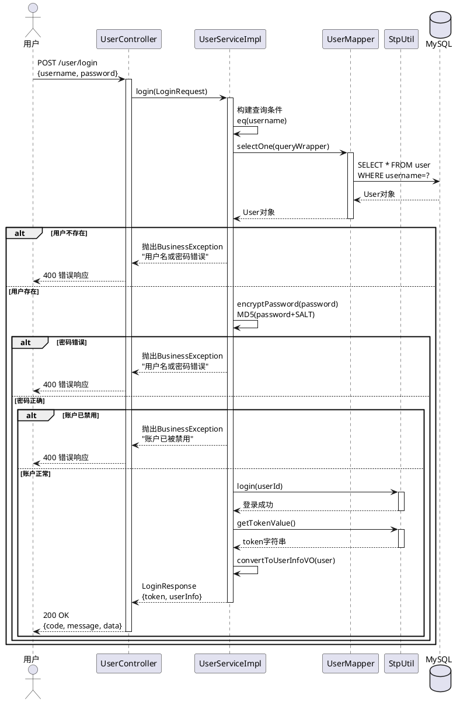

## 2. 用户注册功能 - 顺序图

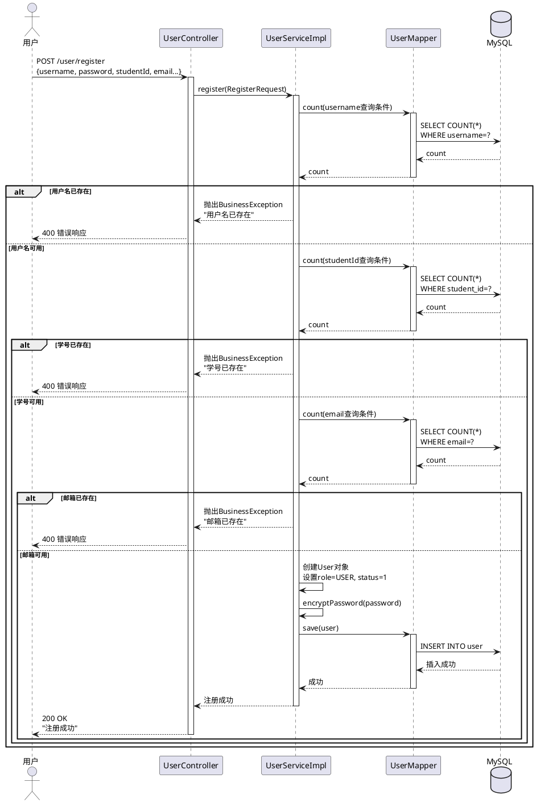

## 3. 申请加入社团功能 - 顺序图

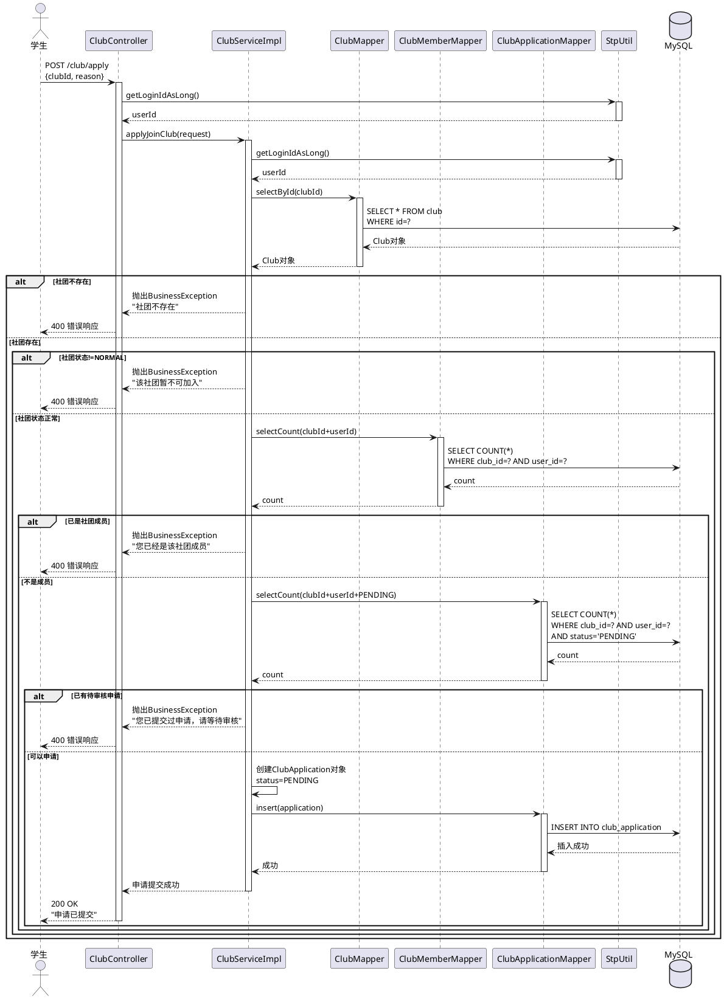

## 4. 审核入社申请功能 - 顺序图

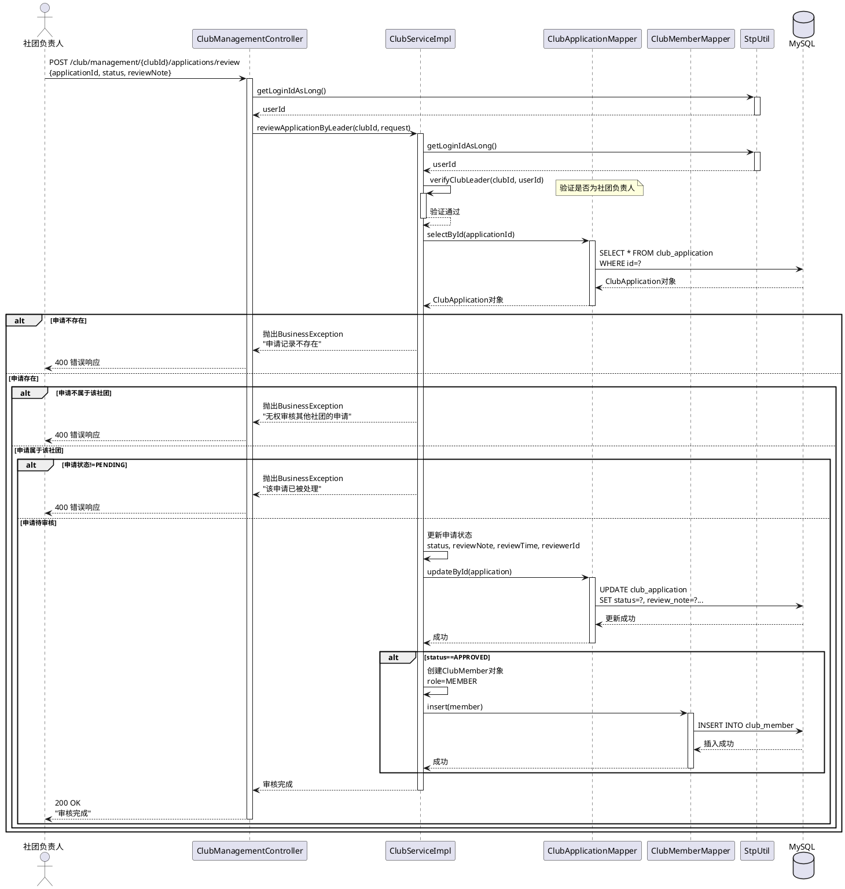

## 5. 创建活动功能 - 顺序图

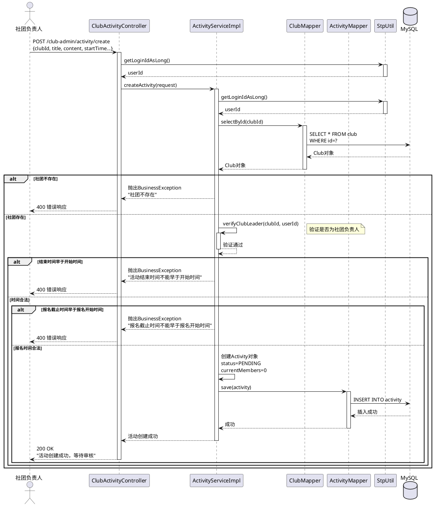

## 6. 活动报名功能 - 顺序图

```plantuml
@startuml
actor 学生
participant ActivityController
participant ActivityServiceImpl
participant ActivityMapper
participant ActivitySignupMapper
participant StpUtil
database MySQL

学生 -> ActivityController: POST /activity/{id}/signup
activate ActivityController

ActivityController -> StpUtil: getLoginIdAsLong()
activate StpUtil
StpUtil --> ActivityController: userId
deactivate StpUtil

ActivityController -> ActivityServiceImpl: signupActivity(activityId)
activate ActivityServiceImpl

ActivityServiceImpl -> StpUtil: getLoginIdAsLong()
activate StpUtil
StpUtil --> ActivityServiceImpl: userId
deactivate StpUtil

ActivityServiceImpl -> ActivityMapper: getById(activityId)
activate ActivityMapper
ActivityMapper -> MySQL: SELECT * FROM activity\nWHERE id=?
MySQL --> ActivityMapper: Activity对象
ActivityMapper --> ActivityServiceImpl: Activity对象
deactivate ActivityMapper

alt 活动不存在
    ActivityServiceImpl --> ActivityController: 抛出BusinessException\n"活动不存在"
    ActivityController --> 学生: 400 错误响应
else 活动存在
    alt 活动状态!=PUBLISHED
        ActivityServiceImpl --> ActivityController: 抛出BusinessException\n"该活动不可报名"
        ActivityController --> 学生: 400 错误响应
    else 活动已发布
        ActivityServiceImpl -> ActivityServiceImpl: 获取当前时间now
        
        alt 报名未开始
            ActivityServiceImpl --> ActivityController: 抛出BusinessException\n"报名尚未开始"
            ActivityController --> 学生: 400 错误响应
        else 报名已截止
            ActivityServiceImpl --> ActivityController: 抛出BusinessException\n"报名已截止"
            ActivityController --> 学生: 400 错误响应
        else 报名时间内
            ActivityServiceImpl -> ActivitySignupMapper: selectOne(activityId+userId)
            activate ActivitySignupMapper
            ActivitySignupMapper -> MySQL: SELECT * FROM activity_signup\nWHERE activity_id=? AND user_id=?
            MySQL --> ActivitySignupMapper: ActivitySignup对象或null
            ActivitySignupMapper --> ActivityServiceImpl: existingSignup
            deactivate ActivitySignupMapper
            
            alt 已报名(status=REGISTERED)
                ActivityServiceImpl --> ActivityController: 抛出BusinessException\n"您已报名该活动"
                ActivityController --> 学生: 400 错误响应
            else 曾取消报名(status=CANCELLED)
                ActivityServiceImpl -> ActivityServiceImpl: 更新报名记录\nstatus=REGISTERED
                ActivityServiceImpl -> ActivitySignupMapper: updateById(signup)
                activate ActivitySignupMapper
                ActivitySignupMapper -> MySQL: UPDATE activity_signup\nSET status='REGISTERED'
                MySQL --> ActivitySignupMapper: 更新成功
                ActivitySignupMapper --> ActivityServiceImpl: 成功
                deactivate ActivitySignupMapper
                
                ActivityServiceImpl -> ActivityServiceImpl: currentMembers++
                ActivityServiceImpl -> ActivityMapper: updateById(activity)
                activate ActivityMapper
                ActivityMapper -> MySQL: UPDATE activity\nSET current_members=?
                MySQL --> ActivityMapper: 更新成功
                ActivityMapper --> ActivityServiceImpl: 成功
                deactivate ActivityMapper
                
                ActivityServiceImpl --> ActivityController: 报名成功
                deactivate ActivityServiceImpl
                ActivityController --> 学生: 200 OK\n"报名成功"
                deactivate ActivityController
            else 未报名过
                alt 人数已满
                    ActivityServiceImpl --> ActivityController: 抛出BusinessException\n"活动报名人数已满"
                    ActivityController --> 学生: 400 错误响应
                else 人数未满
                    ActivityServiceImpl -> ActivityServiceImpl: 创建ActivitySignup对象\nstatus=REGISTERED
                    ActivityServiceImpl -> ActivitySignupMapper: insert(signup)
                    activate ActivitySignupMapper
                    ActivitySignupMapper -> MySQL: INSERT INTO activity_signup
                    MySQL --> ActivitySignupMapper: 插入成功
                    ActivitySignupMapper --> ActivityServiceImpl: 成功
                    deactivate ActivitySignupMapper
                    
                    ActivityServiceImpl -> ActivityServiceImpl: currentMembers++
                    ActivityServiceImpl -> ActivityMapper: updateById(activity)
                    activate ActivityMapper
                    ActivityMapper -> MySQL: UPDATE activity\nSET current_members=?
                    MySQL --> ActivityMapper: 更新成功
                    ActivityMapper --> ActivityServiceImpl: 成功
                    deactivate ActivityMapper
                    
                    ActivityServiceImpl --> ActivityController: 报名成功
                    deactivate ActivityServiceImpl
                    ActivityController --> 学生: 200 OK\n"报名成功"
                    deactivate ActivityController
                end
            end
        end
    end
end

@enduml
```

## 7. 社团申请审核流程 - 协作图

```plantuml
@startuml
object "1:学生" as Student
object "2:ClubController" as Controller
object "3:ClubServiceImpl" as Service
object "4:ClubApplicationMapper" as AppMapper
object "5:ClubMemberMapper" as MemberMapper
object "6:MySQL数据库" as DB

Student -> Controller : 1.1: POST /club/apply\n{clubId, reason}
Controller -> Service : 1.2: applyJoinClub(request)
Service -> Service : 1.3: 验证社团存在性和状态
Service -> AppMapper : 1.4: 检查是否已申请
AppMapper -> DB : 1.5: SELECT COUNT(*)
DB --> AppMapper : 1.6: count=0
AppMapper --> Service : 1.7: 未申请
Service -> AppMapper : 1.8: insert(application)
AppMapper -> DB : 1.9: INSERT INTO club_application
DB --> AppMapper : 1.10: 插入成功
AppMapper --> Service : 1.11: 成功
Service --> Controller : 1.12: 申请提交成功
Controller --> Student : 1.13: 200 OK

note right of Service
  协作关系：
  - 学生通过Controller提交申请
  - Service协调业务逻辑验证
  - AppMapper负责数据持久化
  - 最终结果返回给学生
end note

object "2.1:社团负责人" as Leader
object "2.2:ClubManagementController" as MgmtController

Leader -> MgmtController : 2.1: POST /club/management/{clubId}/applications/review
MgmtController -> Service : 2.2: reviewApplicationByLeader(clubId, request)
Service -> Service : 2.3: verifyClubLeader(clubId, userId)
Service -> AppMapper : 2.4: selectById(applicationId)
AppMapper -> DB : 2.5: SELECT * FROM club_application
DB --> AppMapper : 2.6: ClubApplication对象
AppMapper --> Service : 2.7: application
Service -> AppMapper : 2.8: updateById(application)\n设置status=APPROVED
AppMapper -> DB : 2.9: UPDATE club_application
DB --> AppMapper : 2.10: 更新成功
Service -> MemberMapper : 2.11: insert(member)\n添加为社团成员
MemberMapper -> DB : 2.12: INSERT INTO club_member
DB --> MemberMapper : 2.13: 插入成功
MemberMapper --> Service : 2.14: 成功
Service --> MgmtController : 2.15: 审核完成
MgmtController --> Leader : 2.16: 200 OK

@enduml
```

## 8. 活动报名流程 - 协作图

```plantuml
@startuml
object "1:学生" as Student
object "2:ActivityController" as Controller
object "3:ActivityServiceImpl" as Service
object "4:ActivityMapper" as ActMapper
object "5:ActivitySignupMapper" as SignupMapper
object "6:MySQL数据库" as DB

Student -> Controller : 1.1: POST /activity/{id}/signup
Controller -> Service : 1.2: signupActivity(activityId)
Service -> ActMapper : 1.3: getById(activityId)
ActMapper -> DB : 1.4: SELECT * FROM activity
DB --> ActMapper : 1.5: Activity对象
ActMapper --> Service : 1.6: activity
Service -> Service : 1.7: 验证活动状态、报名时间、人数限制
Service -> SignupMapper : 1.8: selectOne(activityId+userId)
SignupMapper -> DB : 1.9: SELECT * FROM activity_signup
DB --> SignupMapper : 1.10: null(未报名)
SignupMapper --> Service : 1.11: null
Service -> SignupMapper : 1.12: insert(signup)\nstatus=REGISTERED
SignupMapper -> DB : 1.13: INSERT INTO activity_signup
DB --> SignupMapper : 1.14: 插入成功
SignupMapper --> Service : 1.15: 成功
Service -> ActMapper : 1.16: updateById(activity)\ncurrentMembers++
ActMapper -> DB : 1.17: UPDATE activity
DB --> ActMapper : 1.18: 更新成功
ActMapper --> Service : 1.19: 成功
Service --> Controller : 1.20: 报名成功
Controller --> Student : 1.21: 200 OK

note right of Service
  协作关系：
  - 学生发起报名请求
  - Service验证活动状态和报名条件
  - SignupMapper创建报名记录
  - ActMapper更新活动报名人数
  - 事务保证数据一致性
end note

@enduml
```

## 9. 社团状态流转 - 状态图

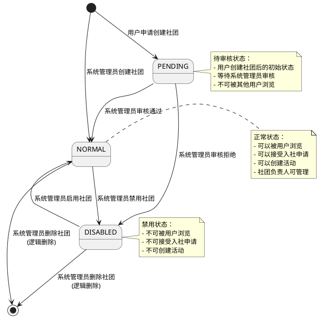

## 10. 入社申请状态流转 - 状态图

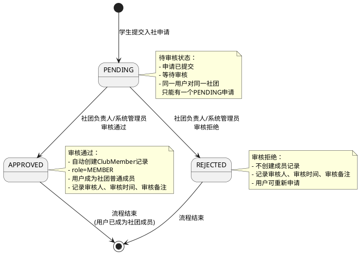

## 11. 活动状态流转 - 状态图

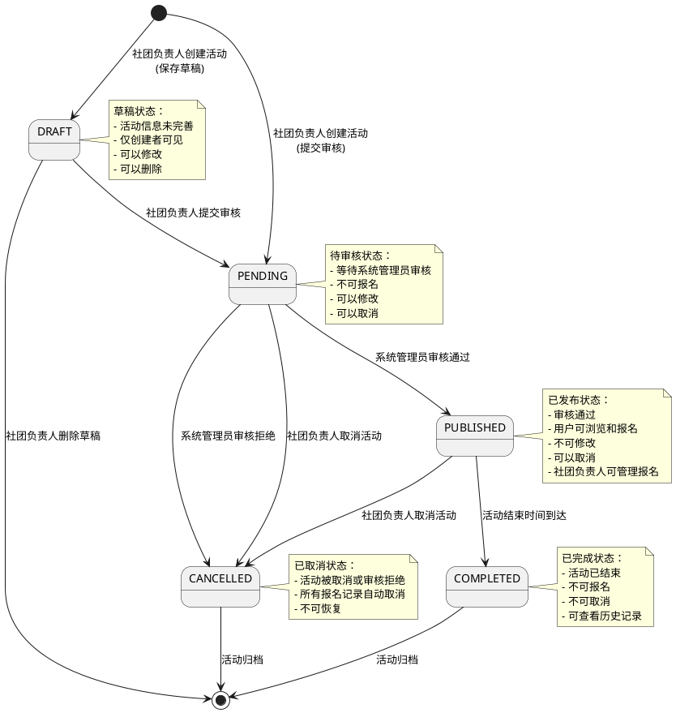

## 12. 活动报名状态流转 - 状态图

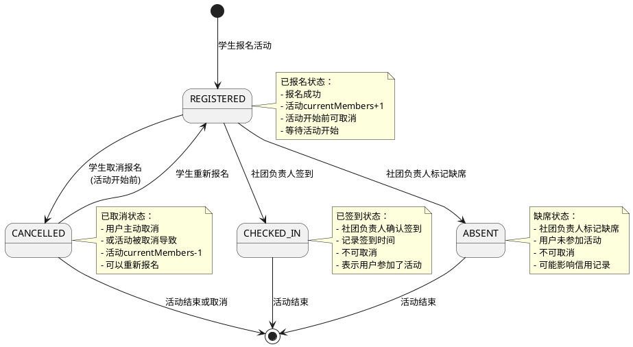

## 13. 权限验证流程 - 协作图

```plantuml
@startuml
object "1:用户请求" as Request
object "2:SaTokenInterceptor" as Interceptor
object "3:Controller" as Controller
object "4:StpUtil" as StpUtil
object "5:ServiceImpl" as Service
object "6:ClubMemberMapper" as Mapper
object "7:MySQL数据库" as DB

Request -> Interceptor : 1.1: HTTP请求\nHeader: Authorization=token
Interceptor -> StpUtil : 1.2: checkLogin()\n验证token有效性
StpUtil --> Interceptor : 1.3: token有效
Interceptor -> StpUtil : 1.4: checkRole("user")\n验证用户角色
StpUtil
```