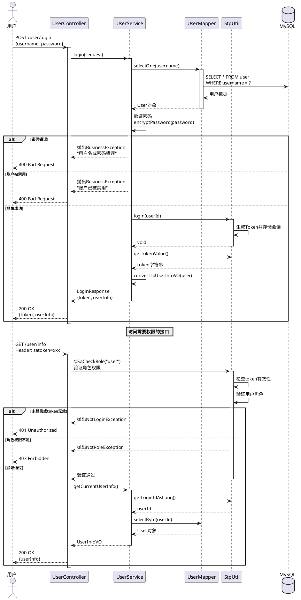
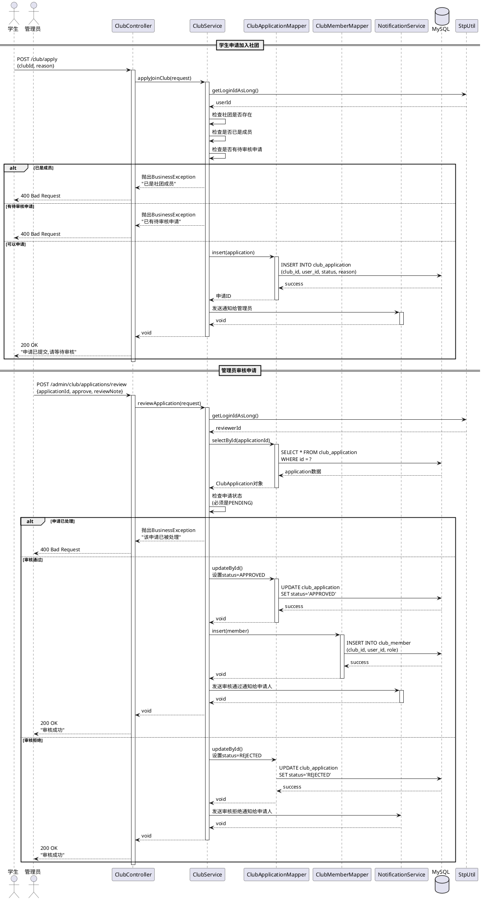
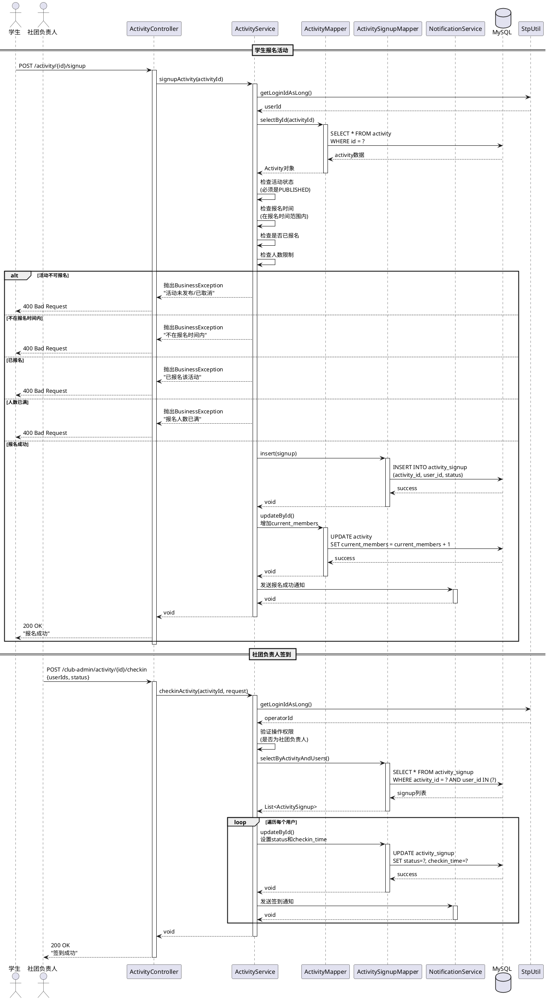
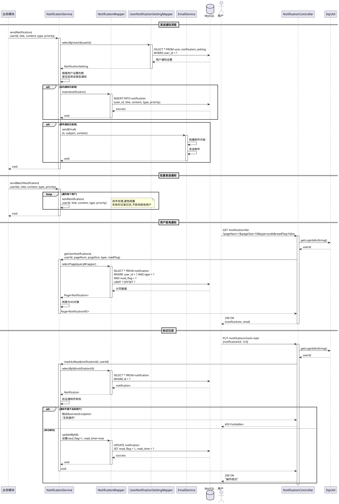
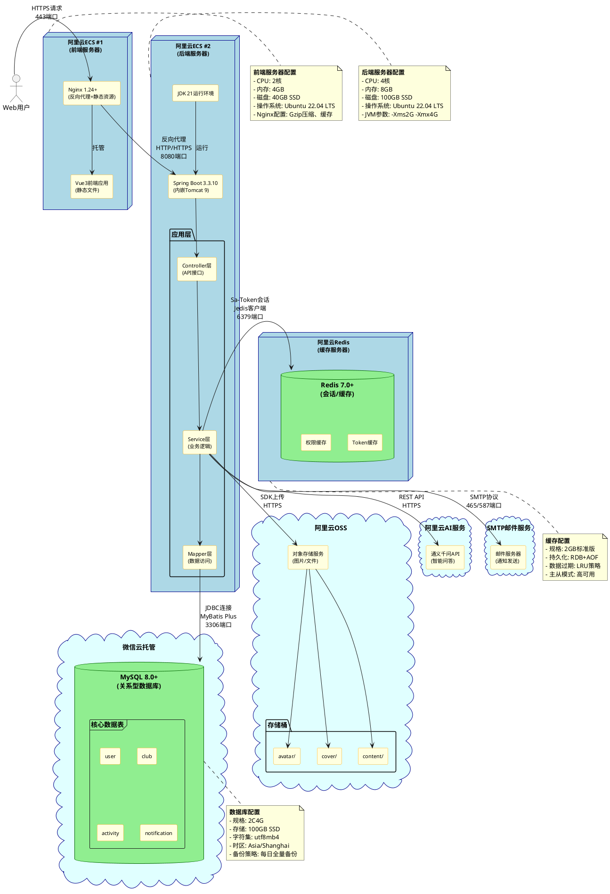

# 第5章 详细设计

## 5.1 核心功能时序图

本系统选取了以下4个核心功能进行详细设计:

1. **用户登录与权限验证** - 展示Sa-Token认证授权流程
2. **社团申请与审核** - 展示完整的审批业务流程
3. **活动报名与签到** - 展示活动管理核心流程
4. **通知系统** - 展示异步消息通知机制

### 1.1 用户登录与权限验证流程

该功能展示了系统的认证授权机制,包括用户登录、Token生成和基于角色的权限验证。



**流程说明**:
1. 用户提交用户名和密码
2. 系统验证用户名、密码和账户状态
3. 验证通过后,Sa-Token生成并返回Token
4. 后续请求携带Token访问需要权限的接口
5. `@SaCheckRole`注解自动验证用户角色

---

### 1.2 社团申请与审核流程

该功能展示了完整的业务审批流程,包括申请提交、状态管理、审核处理和通知发送。



**流程说明**:
1. 学生提交加入社团申请,状态为PENDING
2. 系统验证是否已是成员或有待审核申请
3. 管理员查看待审核申请列表
4. 管理员审核申请(通过/拒绝)
5. 审核通过自动添加为社团成员
6. 系统发送通知给申请人

---

### 1.3 活动报名与签到流程

该功能展示了活动管理的核心流程,包括报名验证、人数控制和签到管理。



**流程说明**:
1. 学生浏览活动列表并选择活动报名
2. 系统验证活动状态、报名时间和人数限制
3. 创建报名记录,更新活动当前报名人数
4. 活动开始时,社团负责人批量为用户签到
5. 支持标记缺席,记录签到时间

---

### 1.4 通知系统流程

该功能展示了系统的异步通知机制,支持多渠道(站内+邮件)和用户偏好设置。



**流程说明**:
1. 业务模块触发通知发送(如审核通过)
2. 查询用户通知偏好设置
3. 根据设置选择渠道(站内/邮件)
4. 异步发送通知,不阻塞主业务
5. 用户查询通知列表,支持筛选
6. 用户标记已读,记录阅读时间

---

## 5.2 关键代码

详见独立文档: [5.2-关键代码.md](./5.2-关键代码.md)

包含以下5段核心代码及详细注释:
1. 用户登录与Sa-Token权限验证
2. 社团申请审核与事务管理
3. 活动报名与并发控制
4. 活动签到批量操作
5. 异步通知系统

---

## 5.3 系统部署图

本系统采用云原生架构,前后端分离部署在阿里云ECS服务器上,使用微信云托管MySQL作为数据库服务。



### 部署架构说明

#### 1. **前端部署(阿里云ECS #1)**
- **Web服务器**: Nginx 1.24+
  - 反向代理: 将API请求转发到后端服务器
  - 静态资源托管: 托管Vue3构建后的静态文件
  - Gzip压缩: 减少传输数据量
  - 浏览器缓存: 优化静态资源加载速度
  - HTTPS配置: SSL/TLS证书加密通信

- **前端应用**: Vue3 + Vite构建
  - 单页应用(SPA)架构
  - 代码分割和懒加载
  - 生产环境优化构建

#### 2. **后端部署(阿里云ECS #2)**
- **运行环境**: JDK 21 + Spring Boot 3.3.10
  - 内嵌Tomcat容器,默认8080端口
  - JVM优化参数配置
  - 健康检查端点

- **应用分层**:
  - Controller层: RESTful API接口
  - Service层: 业务逻辑处理
  - Mapper层: MyBatis Plus数据访问

- **进程管理**:
  - 使用systemd或PM2管理Java进程
  - 自动重启和日志管理
  - 优雅关闭机制

#### 3. **数据库服务(微信云托管MySQL)**
- **MySQL 8.0+**
  - 关系型数据库存储
  - 支持事务ACID特性
  - InnoDB存储引擎
  - 自动备份和恢复
  - 读写分离(可选)

#### 4. **缓存服务(阿里云Redis)**
- **Redis 7.0+**
  - Sa-Token会话存储
  - 权限信息缓存
  - 热点数据缓存
  - 分布式锁实现
  - 主从高可用架构

#### 5. **对象存储(阿里云OSS)**
- **文件存储服务**
  - 用户头像存储(avatar/)
  - 活动封面存储(cover/)
  - 富文本图片存储(content/)
  - CDN加速访问
  - 图片处理服务

#### 6. **第三方服务**
- **阿里云AI服务**: 提供智能问答功能
- **SMTP邮件服务**: 发送系统通知邮件
- **SSL证书服务**: HTTPS安全通信

#### 7. **网络配置**
- **安全组策略**:
  - 前端ECS: 开放80(HTTP)、443(HTTPS)端口
  - 后端ECS: 仅允许前端ECS访问8080端口
  - 数据库: 仅允许后端ECS访问3306端口
  - Redis: 仅允许后端ECS访问6379端口

- **负载均衡(可扩展)**:
  - 使用阿里云SLB实现多实例负载均衡
  - 支持水平扩展

#### 8. **部署流程**
1. **前端部署**:
   ```bash
   npm run build  # 本地构建
   scp -r dist/* user@ecs1:/var/www/html/  # 上传到服务器
   nginx -s reload  # 重载Nginx配置
   ```

2. **后端部署**:
   ```bash
   mvn clean package  # Maven打包
   scp target/*.jar user@ecs2:/app/  # 上传jar包
   systemctl restart campus-club-backend  # 重启服务
   ```

#### 9. **监控与运维**
- **日志管理**:
  - Nginx访问日志和错误日志
  - Spring Boot应用日志(Logback)
  - 日志轮转和归档

- **性能监控**:
  - 阿里云云监控
  - JVM性能指标
  - 数据库慢查询分析
  - Redis性能监控

- **备份策略**:
  - 数据库每日自动备份
  - 代码版本控制(Git)
  - 配置文件备份

---

## 设计亮点总结

### 1. 架构设计
- **分层清晰**: Controller-Service-Mapper三层架构,职责明确
- **面向接口**: Service层定义接口,利于扩展和测试
- **依赖注入**: 使用@RequiredArgsConstructor实现构造器注入

### 2. 事务管理
- **声明式事务**: @Transactional注解管理事务边界
- **原子性保证**: 多表操作在同一事务中,保证数据一致性
- **回滚策略**: rollbackFor = Exception.class确保异常回滚

### 3. 权限控制
- **Sa-Token集成**: 轻量级权限框架,自动管理会话
- **注解驱动**: @SaCheckRole实现声明式权限验证
- **细粒度控制**: 方法级权限验证,确保数据安全

### 4. 性能优化
- **异步处理**: 通知发送使用@Async,不阻塞主流程
- **冗余字段**: current_members避免频繁COUNT查询
- **批量操作**: 签到支持批量处理,减少数据库交互

### 5. 代码质量
- **异常处理**: 统一BusinessException,友好错误提示
- **参数校验**: @Valid注解实现参数自动验证
- **日志记录**: @Slf4j注解,关键操作记录日志
- **代码复用**: 公共方法提取,避免重复代码
