# 校园社团管理系统设计文档

---

# 一、概要设计文档

## 1. 项目技术选型说明

### 1.1 后端技术栈

| 技术 | 版本 | 说明 | 选型理由 |
|------|------|------|----------|
| **Java** | 17 | 编程语言 | LTS版本、性能优化、现代语法特性 |
| **Maven** | 3.8+ | 构建工具 | 依赖管理成熟、插件生态丰富 |
| **Spring Boot** | 3.4.4 | 应用框架 | 简化配置、快速开发、生态完善 |
| **MyBatis Plus** | 3.5.9 | ORM框架 | 强大的CRUD操作、代码生成、分页插件 |
| **Sa-Token** | 1.44.0 | 权限认证框架 | 轻量级、功能完善、易于集成RBAC |
| **MySQL** | 8.0+ | 关系型数据库 | 成熟稳定、支持事务、适合结构化数据 |
| **HikariCP** | 5.0+ | 数据库连接池 | 性能最优、Spring Boot默认集成 |
| **Logback** | 1.4+ | 日志框架 | SLF4J实现、Spring Boot默认、配置灵活 |
| **Lombok** | 1.18.30 | 代码简化工具 | 减少样板代码、提高开发效率 |
| **Validation** | 3.0+ | 参数校验 | JSR-303标准、声明式校验 |
| **SpringDoc OpenAPI** | 2.3+ | API文档 | 自动生成Swagger文档、支持在线测试 |
| **Aliyun OSS** | 3.17+ | 对象存储 | 文件上传、CDN加速 |

### 1.2 核心框架选型对比

#### Spring Boot vs 其他框架

| 对比项 | Spring Boot | Spring MVC | Quarkus | Micronaut |
|--------|-------------|------------|---------|-----------|
| **配置复杂度** | 自动配置，零XML | 需要大量XML配置 | 注解配置 | 注解配置 |
| **启动速度** | 中等（2-5秒） | 慢（5-10秒） | 快（<1秒） | 快（<1秒） |
| **生态成熟度** | ⭐⭐⭐⭐⭐ | ⭐⭐⭐⭐⭐ | ⭐⭐⭐ | ⭐⭐⭐ |
| **学习曲线** | 平缓 | 陡峭 | 中等 | 中等 |
| **社区支持** | 非常活跃 | 活跃 | 成长中 | 成长中 |
| **企业应用** | 广泛使用 | 传统项目 | 云原生场景 | 微服务场景 |

**选择Spring Boot的原因**：
- 校园项目对启动速度要求不高，更看重开发效率
- 生态成熟，第三方库集成简单（Sa-Token、MyBatis Plus等）
- 团队熟悉度高，学习成本低
- 社区资源丰富，问题解决快

#### MyBatis Plus vs 其他ORM

| 对比项 | MyBatis Plus | MyBatis | JPA/Hibernate | jOOQ |
|--------|--------------|---------|---------------|------|
| **SQL控制** | 灵活可控 | 完全可控 | 自动生成 | 类型安全SQL |
| **代码生成** | ⭐⭐⭐⭐⭐ | ⭐⭐ | ⭐⭐⭐ | ⭐⭐⭐⭐ |
| **学习成本** | 低 | 中 | 高 | 中 |
| **复杂查询** | 支持良好 | 最灵活 | 较复杂 | 优秀 |
| **性能优化** | 易于优化 | 易于优化 | 需要调优 | 优秀 |

**选择MyBatis Plus的原因**：
- 继承MyBatis的SQL可控性，避免JPA的N+1查询问题
- 内置CRUD方法，减少80%重复代码
- 代码生成器快速搭建项目骨架
- 分页插件开箱即用，无需手写分页逻辑

#### Sa-Token vs 其他认证框架

| 对比项 | Sa-Token | Spring Security | Shiro | JWT |
|--------|----------|-----------------|-------|-----|
| **上手难度** | ⭐简单 | ⭐⭐⭐⭐复杂 | ⭐⭐中等 | ⭐⭐中等 |
| **功能完整性** | 认证+授权+SSO | 企业级全功能 | 认证+授权 | 仅token |
| **配置复杂度** | 极简 | 复杂 | 中等 | 需自行实现 |
| **文档友好度** | 中文文档详细 | 英文为主 | 中文资源多 | 需自行设计 |
| **适用场景** | 中小型项目 | 大型企业应用 | 传统Web应用 | 微服务 |

**选择Sa-Token的原因**：
- 校园项目权限模型简单（用户、社团管理员、系统管理员）
- 注解式鉴权，代码简洁易读（`@SaCheckRole("admin")`）
- 中文文档完善，团队学习成本低
- 轻量级，不需要Spring Security的复杂配置

### 1.3 技术选型优势

- **开发效率高**：Spring Boot自动配置 + MyBatis Plus代码生成
- **安全性强**：Sa-Token提供完善的认证授权机制
- **易于维护**：分层架构清晰、代码规范统一
- **扩展性好**：支持水平扩展、模块化设计
- **性能优异**：MyBatis Plus优化查询、HikariCP高性能连接池

## 2. 项目架构图

### 2.1 MVC分层架构

本项目采用经典的MVC三层架构模式，分为以下层次：

**架构层次说明：**

1. **Controller层（控制层）**
   - 职责：接收HTTP请求，参数校验，调用Service层，返回响应
   - 技术：Spring MVC、@RestController、@RequestMapping
   - 特点：薄控制器，只负责请求转发和响应封装

2. **Service层（业务逻辑层）**
   - 职责：核心业务逻辑处理，事务管理，权限验证
   - 技术：@Service、@Transactional
   - 特点：业务逻辑集中，可复用

3. **Mapper层（数据访问层）**
   - 职责：数据库CRUD操作，SQL执行
   - 技术：MyBatis Plus、BaseMapper
   - 特点：继承BaseMapper，自动生成常用方法

4. **Entity层（实体层）**
   - 职责：数据库表映射，数据传输
   - 技术：@TableName、@TableId
   - 特点：与数据库表一一对应

5. **VO/DTO层（数据传输对象）**
   - 职责：前后端数据交互，数据封装
   - 技术：Java Bean、@Data
   - 特点：隔离内部实体，保护敏感信息

### 2.2 系统架构图

.png)


### 2.3 MVC请求处理流程

```mermaid
sequenceDiagram
    participant Client as 客户端
    participant Interceptor as Sa-Token拦截器
    participant Controller as Controller层
    participant Service as Service层
    participant Mapper as Mapper层
    participant DB as MySQL数据库

    Client->>Interceptor: HTTP请求 + Token
    Interceptor->>Interceptor: 验证Token
    Interceptor->>Controller: 注入用户信息
    Controller->>Controller: 参数校验(@Valid)
    Controller->>Controller: 权限验证(@SaCheckRole)
    Controller->>Service: 调用业务方法
    Service->>Service: 业务逻辑处理
    Service->>Mapper: 数据库操作
    Mapper->>DB: SQL查询
    DB-->>Mapper: 返回结果
    Mapper-->>Service: 返回Entity
    Service-->>Controller: 返回业务数据
    Controller-->>Client: 统一响应Result<T>
```



## 3. 数据库设计

### 3.1 数据库ER图

```mermaid
erDiagram
    USER ||--o{ CLUB : "创建"
    USER ||--o{ CLUB_MEMBER : "加入"
    USER ||--o{ CLUB_APPLICATION : "申请"
    USER ||--o{ ACTIVITY : "创建"
    USER ||--o{ ACTIVITY_SIGNUP : "报名"
    USER ||--o{ NOTIFICATION : "接收"
    USER ||--o{ ANNOUNCEMENT : "发布"

    CLUB ||--o{ CLUB_MEMBER : "拥有"
    CLUB ||--o{ CLUB_APPLICATION : "收到"
    CLUB ||--o{ ACTIVITY : "举办"

    ACTIVITY ||--o{ ACTIVITY_SIGNUP : "接受"

    USER {
        bigint id PK "用户ID"
        varchar username UK "用户名"
        varchar password "密码"
        varchar real_name "真实姓名"
        varchar student_id UK "学号"
        varchar email UK "邮箱"
        varchar phone "手机号"
        varchar avatar "头像URL"
        varchar role "角色"
        tinyint status "状态"
        datetime create_time "创建时间"
        datetime update_time "更新时间"
        tinyint is_deleted "删除标记"
    }

    CLUB {
        bigint id PK "社团ID"
        varchar name UK "社团名称"
        text description "社团简介"
        varchar logo "社团图标"
        varchar status "状态"
        bigint create_user FK "创建者ID"
        datetime create_time "创建时间"
        datetime update_time "更新时间"
        tinyint is_deleted "删除标记"
    }

    CLUB_MEMBER {
        bigint id PK "成员关系ID"
        bigint club_id FK "社团ID"
        bigint user_id FK "用户ID"
        varchar role "成员角色"
        datetime join_time "加入时间"
        varchar memo "备注"
        datetime create_time "创建时间"
        datetime update_time "更新时间"
        tinyint is_deleted "删除标记"
    }

    CLUB_APPLICATION {
        bigint id PK "申请ID"
        bigint club_id FK "社团ID"
        bigint user_id FK "用户ID"
        varchar status "申请状态"
        text reason "申请理由"
        text review_note "审核备注"
        datetime review_time "审核时间"
        bigint reviewer_id FK "审核人ID"
        datetime create_time "创建时间"
        datetime update_time "更新时间"
        tinyint is_deleted "删除标记"
    }

    ACTIVITY {
        bigint id PK "活动ID"
        bigint club_id FK "社团ID"
        varchar title "活动标题"
        text content "活动内容"
        varchar cover "封面图"
        varchar location "活动地点"
        datetime start_time "开始时间"
        datetime end_time "结束时间"
        datetime signup_start_time "报名开始"
        datetime signup_end_time "报名截止"
        varchar status "活动状态"
        int max_members "最大人数"
        int current_members "当前人数"
        bigint create_user FK "创建者ID"
        datetime create_time "创建时间"
        datetime update_time "更新时间"
        tinyint is_deleted "删除标记"
    }

    ACTIVITY_SIGNUP {
        bigint id PK "报名ID"
        bigint activity_id FK "活动ID"
        bigint user_id FK "用户ID"
        varchar status "报名状态"
        datetime signup_time "报名时间"
        datetime checkin_time "签到时间"
        varchar remark "备注"
        datetime create_time "创建时间"
        datetime update_time "更新时间"
        tinyint is_deleted "删除标记"
    }

    ANNOUNCEMENT {
        bigint id PK "公告ID"
        varchar title "公告标题"
        text content "公告内容"
        varchar type "公告类型"
        bigint related_id "关联ID"
        tinyint priority "优先级"
        varchar status "状态"
        bigint create_user_id FK "创建者ID"
        datetime publish_time "发布时间"
        datetime expire_time "过期时间"
        datetime create_time "创建时间"
        datetime update_time "更新时间"
        tinyint is_deleted "删除标记"
    }

    NOTIFICATION {
        bigint id PK "通知ID"
        bigint user_id FK "用户ID"
        varchar title "通知标题"
        text content "通知内容"
        varchar type "通知类型"
        varchar related_type "关联类型"
        bigint related_id "关联ID"
        tinyint read_flag "阅读标记"
        datetime read_time "阅读时间"
        datetime create_time "创建时间"
        datetime update_time "更新时间"
        tinyint is_deleted "删除标记"
    }
```




### 3.2 数据库表设计

#### 3.2.1 用户表 (user)

| 字段名 | 类型 | 长度 | 允许NULL | 默认值 | 索引 | 说明 |
|--------|------|------|----------|--------|------|------|
| id | bigint | - | NO | AUTO_INCREMENT | PK | 用户ID，主键 |
| username | varchar | 50 | NO | - | UK | 用户名，唯一 |
| password | varchar | 255 | NO | - | - | 密码（加密存储） |
| real_name | varchar | 50 | NO | - | - | 真实姓名 |
| student_id | varchar | 50 | NO | - | UK | 学号，唯一 |
| email | varchar | 100 | NO | - | UK | 邮箱，唯一 |
| phone | varchar | 20 | YES | NULL | - | 手机号 |
| avatar | varchar | 500 | YES | NULL | - | 头像URL |
| role | varchar | 20 | NO | 'user' | INDEX | 用户角色：user-普通用户, club_admin-社团管理员, system_admin-系统管理员 |
| status | tinyint | - | NO | 1 | INDEX | 账户状态：0-禁用，1-正常 |
| create_time | datetime | - | NO | CURRENT_TIMESTAMP | - | 创建时间 |
| update_time | datetime | - | NO | CURRENT_TIMESTAMP | - | 更新时间（自动更新） |
| is_deleted | tinyint | - | NO | 0 | - | 逻辑删除标记：0-未删除，1-已删除 |

#### 3.2.2 社团表 (club)

| 字段名 | 类型 | 长度 | 允许NULL | 默认值 | 索引 | 说明 |
|--------|------|------|----------|--------|------|------|
| id | bigint | - | NO | AUTO_INCREMENT | PK | 社团ID，主键 |
| name | varchar | 100 | NO | - | UK | 社团名称，唯一（配合is_deleted） |
| description | text | - | YES | NULL | - | 社团简介 |
| logo | varchar | 500 | YES | NULL | - | 社团图标URL |
| status | varchar | 20 | NO | 'normal' | INDEX | 社团状态：pending-审核中, normal-正常, disabled-已禁用 |
| create_user | bigint | - | NO | - | INDEX, FK | 创建者用户ID，外键关联user表 |
| create_time | datetime | - | NO | CURRENT_TIMESTAMP | INDEX | 创建时间 |
| update_time | datetime | - | NO | CURRENT_TIMESTAMP | - | 更新时间（自动更新） |
| is_deleted | tinyint | - | NO | 0 | - | 逻辑删除标记：0-未删除，1-已删除 |

**外键约束：**
- `fk_club_create_user`: create_user → user(id)，级联限制删除

#### 3.2.3 社团成员表 (club_member)

| 字段名 | 类型 | 长度 | 允许NULL | 默认值 | 索引 | 说明 |
|--------|------|------|----------|--------|------|------|
| id | bigint | - | NO | AUTO_INCREMENT | PK | 成员关系ID，主键 |
| club_id | bigint | - | NO | - | UK, FK | 社团ID，外键关联club表 |
| user_id | bigint | - | NO | - | UK, INDEX, FK | 用户ID，外键关联user表 |
| role | varchar | 20 | NO | 'member' | INDEX | 成员角色：member-普通成员, leader-社长/负责人 |
| join_time | datetime | - | YES | NULL | INDEX | 加入时间 |
| memo | varchar | 500 | YES | NULL | - | 备注信息 |
| create_time | datetime | - | NO | CURRENT_TIMESTAMP | - | 创建时间 |
| update_time | datetime | - | NO | CURRENT_TIMESTAMP | - | 更新时间（自动更新） |
| is_deleted | tinyint | - | NO | 0 | - | 逻辑删除标记：0-未删除，1-已删除 |

**唯一索引：** `uk_club_user(club_id, user_id, is_deleted)` - 防止重复加入

**外键约束：**
- `fk_club_member_club`: club_id → club(id)，级联删除
- `fk_club_member_user`: user_id → user(id)，级联删除

#### 3.2.4 社团申请表 (club_application)

| 字段名 | 类型 | 长度 | 允许NULL | 默认值 | 索引 | 说明 |
|--------|------|------|----------|--------|------|------|
| id | bigint | - | NO | AUTO_INCREMENT | PK | 申请ID，主键 |
| club_id | bigint | - | NO | - | INDEX, FK | 社团ID，外键关联club表 |
| user_id | bigint | - | NO | - | INDEX, FK | 申请用户ID，外键关联user表 |
| status | varchar | 20 | NO | 'pending' | INDEX | 申请状态：pending-待审核, approved-已通过, rejected-已拒绝 |
| reason | text | - | YES | NULL | - | 申请理由 |
| review_note | text | - | YES | NULL | - | 审核备注（管理员填写） |
| review_time | datetime | - | YES | NULL | - | 审核时间 |
| reviewer_id | bigint | - | YES | NULL | INDEX, FK | 审核人ID，外键关联user表 |
| create_time | datetime | - | NO | CURRENT_TIMESTAMP | INDEX | 创建时间 |
| update_time | datetime | - | NO | CURRENT_TIMESTAMP | - | 更新时间（自动更新） |
| is_deleted | tinyint | - | NO | 0 | - | 逻辑删除标记：0-未删除，1-已删除 |

**外键约束：**
- `fk_club_application_club`: club_id → club(id)，级联删除
- `fk_club_application_user`: user_id → user(id)，级联删除
- `fk_club_application_reviewer`: reviewer_id → user(id)，删除时设为NULL

#### 3.2.5 活动表 (activity)

| 字段名 | 类型 | 长度 | 允许NULL | 默认值 | 索引 | 说明 |
|--------|------|------|----------|--------|------|------|
| id | bigint | - | NO | AUTO_INCREMENT | PK | 活动ID，主键 |
| club_id | bigint | - | NO | - | INDEX, FK | 所属社团ID，外键关联club表 |
| title | varchar | 200 | NO | - | - | 活动标题 |
| content | text | - | NO | - | - | 活动内容详情 |
| cover | varchar | 500 | YES | NULL | - | 活动封面图URL |
| location | varchar | 200 | YES | NULL | - | 活动地点 |
| start_time | datetime | - | NO | - | INDEX | 活动开始时间 |
| end_time | datetime | - | NO | - | INDEX | 活动结束时间 |
| signup_start_time | datetime | - | YES | NULL | - | 报名开始时间 |
| signup_end_time | datetime | - | YES | NULL | - | 报名截止时间 |
| status | varchar | 20 | NO | 'draft' | INDEX | 活动状态：draft-草稿, pending-审核中, published-已发布, cancelled-已取消, completed-已完成 |
| max_members | int | - | YES | NULL | - | 最大报名人数（NULL表示不限制） |
| current_members | int | - | NO | 0 | - | 当前报名人数（冗余字段，提高查询性能） |
| create_user | bigint | - | NO | - | INDEX, FK | 创建者用户ID，外键关联user表 |
| create_time | datetime | - | NO | CURRENT_TIMESTAMP | INDEX | 创建时间 |
| update_time | datetime | - | NO | CURRENT_TIMESTAMP | - | 更新时间（自动更新） |
| is_deleted | tinyint | - | NO | 0 | - | 逻辑删除标记：0-未删除，1-已删除 |

**外键约束：**
- `fk_activity_club`: club_id → club(id)，级联删除
- `fk_activity_create_user`: create_user → user(id)，限制删除

**检查约束：**
- `chk_activity_time`: end_time >= start_time，确保结束时间不早于开始时间

#### 3.2.6 活动报名表 (activity_signup)

| 字段名 | 类型 | 长度 | 允许NULL | 默认值 | 索引 | 说明 |
|--------|------|------|----------|--------|------|------|
| id | bigint | - | NO | AUTO_INCREMENT | PK | 报名记录ID，主键 |
| activity_id | bigint | - | NO | - | UK, FK | 活动ID，外键关联activity表 |
| user_id | bigint | - | NO | - | UK, INDEX, FK | 用户ID，外键关联user表 |
| status | varchar | 20 | NO | 'registered' | INDEX | 报名状态：registered-已报名, cancelled-已取消, checked_in-已签到, absent-缺席 |
| signup_time | datetime | - | NO | CURRENT_TIMESTAMP | INDEX | 报名时间 |
| checkin_time | datetime | - | YES | NULL | - | 签到时间 |
| remark | varchar | 500 | YES | NULL | - | 备注信息 |
| create_time | datetime | - | NO | CURRENT_TIMESTAMP | - | 创建时间 |
| update_time | datetime | - | NO | CURRENT_TIMESTAMP | - | 更新时间（自动更新） |
| is_deleted | tinyint | - | NO | 0 | - | 逻辑删除标记：0-未删除，1-已删除 |

**唯一索引：** `uk_activity_user(activity_id, user_id, is_deleted)` - 防止重复报名

**外键约束：**
- `fk_activity_signup_activity`: activity_id → activity(id)，级联删除
- `fk_activity_signup_user`: user_id → user(id)，级联删除

#### 3.2.7 公告表 (announcement)

| 字段名 | 类型 | 长度 | 允许NULL | 默认值 | 索引 | 说明 |
|--------|------|------|----------|--------|------|------|
| id | bigint | - | NO | AUTO_INCREMENT | PK | 公告ID，主键 |
| title | varchar | 200 | NO | - | - | 公告标题 |
| content | text | - | NO | - | - | 公告内容 |
| type | varchar | 20 | NO | 'system' | INDEX | 公告类型：system-系统公告, club-社团公告, activity-活动公告 |
| related_id | bigint | - | YES | NULL | INDEX | 关联ID（社团ID或活动ID，根据type类型关联） |
| priority | tinyint | - | NO | 0 | INDEX | 优先级：0-普通, 1-重要, 2-紧急 |
| status | varchar | 20 | NO | 'published' | INDEX | 状态：draft-草稿, published-已发布, archived-已归档 |
| create_user_id | bigint | - | NO | - | INDEX, FK | 创建者用户ID，外键关联user表 |
| publish_time | datetime | - | YES | NULL | INDEX | 发布时间 |
| expire_time | datetime | - | YES | NULL | - | 过期时间 |
| create_time | datetime | - | NO | CURRENT_TIMESTAMP | - | 创建时间 |
| update_time | datetime | - | NO | CURRENT_TIMESTAMP | - | 更新时间（自动更新） |
| is_deleted | tinyint | - | NO | 0 | - | 逻辑删除标记：0-未删除，1-已删除 |

**外键约束：**
- `fk_announcement_create_user`: create_user_id → user(id)，限制删除

#### 3.2.8 通知表 (notification)

| 字段名 | 类型 | 长度 | 允许NULL | 默认值 | 索引 | 说明 |
|--------|------|------|----------|--------|------|------|
| id | bigint | - | NO | AUTO_INCREMENT | PK | 通知ID，主键 |
| user_id | bigint | - | NO | - | INDEX, FK | 接收用户ID，外键关联user表 |
| title | varchar | 200 | NO | - | - | 通知标题 |
| content | text | - | NO | - | - | 通知内容 |
| type | varchar | 20 | NO | - | INDEX | 通知类型：system-系统通知, audit-审核消息, activity-活动提醒, club-社团通知 |
| related_type | varchar | 20 | YES | NULL | INDEX | 关联类型：club, activity, announcement等 |
| related_id | bigint | - | YES | NULL | INDEX | 关联ID |
| read_flag | tinyint | - | NO | 0 | INDEX | 阅读标记：0-未读, 1-已读 |
| read_time | datetime | - | YES | NULL | - | 阅读时间 |
| create_time | datetime | - | NO | CURRENT_TIMESTAMP | INDEX | 创建时间 |
| update_time | datetime | - | NO | CURRENT_TIMESTAMP | - | 更新时间（自动更新） |
| is_deleted | tinyint | - | NO | 0 | - | 逻辑删除标记：0-未删除，1-已删除 |

**复合索引：** `idx_related(related_type, related_id)` - 优化关联查询

**外键约束：**
- `fk_notification_user`: user_id → user(id)，级联删除

### 3.3 数据库设计说明

#### 3.3.1 设计原则

1. **逻辑删除**：所有表采用逻辑删除（is_deleted字段），保留历史数据便于审计和恢复
2. **时间戳**：统一使用create_time和update_time字段，update_time自动更新
3. **外键约束**：合理使用外键保证数据完整性，根据业务需求选择级联策略
4. **索引优化**：为常用查询字段建立索引，提高查询性能
5. **字符集**：使用utf8mb4字符集，支持emoji等特殊字符
6. **命名规范**：表名、字段名使用小写下划线命名法

#### 3.3.2 性能优化设计

1. **冗余字段**：activity表的current_members字段冗余存储，减少关联查询
2. **复合索引**：为常见组合查询建立复合索引（如uk_club_user、idx_related）
3. **分页查询**：通过create_time等时间字段索引支持高效分页
4. **状态索引**：为status等枚举字段建立索引，优化状态筛选查询

#### 3.3.3 数据完整性保证

1. **唯一约束**：用户名、学号、邮箱等关键字段设置唯一索引
2. **检查约束**：活动表的时间检查约束确保时间逻辑正确
3. **外键级联**：合理设置级联删除和限制删除，防止数据孤岛
4. **默认值**：为状态字段设置合理默认值，简化业务逻辑

## 4. 系统部署架构

### 🌟🌟🌟4.1 部署架构图

> 部署图说明：清晰表达前后端部署位置（本地、云服务器或混合）


### 4.2 部署环境说明

| 环境 | 配置 | 说明 |
|------|------|------|
| **开发环境** | 单机部署 | 本地开发测试 |
| **测试环境** | 2台应用服务器 + 1台数据库 | 功能测试、性能测试 |
| **生产环境** | 3台应用服务器 + MySQL主从 + Redis集群 | 高可用部署 |

### 4.3 部署位置说明

**前后端部署位置：**
- **前端应用**：部署在Nginx服务器，提供静态资源服务
- **后端应用**：部署在应用服务器集群（云服务器），通过Nginx反向代理访问
- **数据库**：独立数据库服务器（云服务器），主从架构保证高可用
- **文件存储**：阿里云OSS云存储服务
- **缓存服务**：Redis集群（云服务器）

---

# 二、详细设计文档

## 1. 系统类图

> 系统类图必须与实际代码类名完全一致，使用英文命名
>
> 类图涵盖控制器、服务层、DAO层及实体类，确保可指导编码


## 2. 接口设计

### 2.1 用户管理模块

**控制器**: `UserController`  
**基础路径**: `/user`  
**功能描述**: 提供用户注册、登录、信息查询和更新等基础功能

#### 2.1.1 用户注册
- **接口路径**: `POST /user/register`
- **权限要求**: 公开接口（无需登录）
- **功能说明**: 用户自助注册账号
- **请求体**: `RegisterRequest`
- **响应**: 注册成功提示


#### 2.1.2 用户登录
- **接口路径**: `POST /user/login`
- **权限要求**: 公开接口（无需登录）
- **功能说明**: 用户登录获取Token
- **请求体**: `LoginRequest`
- **响应**: `LoginResponse`（包含Token和用户信息）

#### 2.1.3 获取当前用户信息
- **接口路径**: `GET /user/info`
- **权限要求**: 需要登录（`@SaCheckRole("user")`）
- **功能说明**: 获取当前登录用户的详细信息
- **响应**: `UserInfoVO`

#### 2.1.4 更新用户信息
- **接口路径**: `POST /user/update`
- **权限要求**: 需要登录（`@SaCheckRole("user")`）
- **功能说明**: 更新当前用户的个人资料
- **请求体**: `UpdateUserRequest`
- **响应**: 更新成功提示

---

### 2.2 社团管理模块

#### 2.2.1 用户端接口

**控制器**: `ClubController`  
**基础路径**: `/club`  
**功能描述**: 提供社团浏览、查询、申请加入等用户端功能

##### 2.2.1.1 分页查询社团列表
- **接口路径**: `GET /club/list`
- **权限要求**: 公开接口（无需登录）
- **功能说明**: 支持关键词搜索的分页社团列表查询
- **请求参数**:
  - `pageNum` (Integer, 默认值: 1): 页码
  - `pageSize` (Integer, 默认值: 10): 每页数量
  - `keyword` (String, 可选): 搜索关键词
- **响应**: `Page<ClubVO>`

##### 2.2.1.2 查询社团详情
- **接口路径**: `GET /club/{id}`
- **权限要求**: 公开接口（无需登录）
- **功能说明**: 查看社团详细信息
- **路径参数**: `id` (Long): 社团ID
- **响应**: `ClubDetailVO`

##### 2.2.1.3 查询我加入的社团
- **接口路径**: `GET /club/my`
- **权限要求**: 需要登录（`@SaCheckRole("user")`）
- **功能说明**: 查看当前用户已加入的社团列表
- **响应**: `List<ClubVO>`

##### 2.2.1.4 申请加入社团
- **接口路径**: `POST /club/apply`
- **权限要求**: 需要登录（`@SaCheckRole("user")`）
- **功能说明**: 提交加入社团的申请
- **请求体**: `ApplyJoinClubRequest`
- **响应**: 申请提交成功提示

##### 2.2.1.5 查询社团成员列表
- **接口路径**: `GET /club/{id}/members`
- **权限要求**: 公开接口（无需登录）
- **功能说明**: 查看社团的成员列表
- **路径参数**: `id` (Long): 社团ID
- **请求参数**:
  - `pageNum` (Integer, 默认值: 1): 页码
  - `pageSize` (Integer, 默认值: 10): 每页数量
- **响应**: `Page<ClubMemberVO>`

##### 2.2.1.6 查询我的申请记录
- **接口路径**: `GET /club/my/applications`
- **权限要求**: 需要登录（`@SaCheckRole("user")`）
- **功能说明**: 查看当前用户的所有社团申请记录
- **响应**: `List<ClubApplicationVO>`

#### 2.2.2 社团负责人接口

**控制器**: `ClubManagementController`  
**基础路径**: `/club/management`  
**功能描述**: 提供社团负责人管理社团的相关功能

##### 2.2.2.1 查询待审核申请列表
- **接口路径**: `GET /club/management/{clubId}/applications/pending`
- **权限要求**: 需要登录（`@SaCheckLogin`），且需要社团负责人权限
- **功能说明**: 查看自己管理的社团的待审核申请
- **路径参数**: `clubId` (Long): 社团ID
- **请求参数**:
  - `pageNum` (Integer, 默认值: 1): 页码
  - `pageSize` (Integer, 默认值: 10): 每页数量
- **响应**: `Page<ClubApplicationVO>`

##### 2.2.2.2 审核社团申请
- **接口路径**: `POST /club/management/{clubId}/applications/review`
- **权限要求**: 需要登录（`@SaCheckLogin`），且需要社团负责人权限
- **功能说明**: 审核通过或拒绝用户的加入申请
- **路径参数**: `clubId` (Long): 社团ID
- **请求体**: `ReviewApplicationRequest`
- **响应**: 审核完成提示

##### 2.2.2.3 更新社团信息
- **接口路径**: `PUT /club/management/{clubId}`
- **权限要求**: 需要登录（`@SaCheckLogin`），且需要社团负责人权限
- **功能说明**: 修改自己管理的社团的基本信息
- **路径参数**: `clubId` (Long): 社团ID
- **请求体**: `UpdateClubRequest`
- **响应**: 更新成功提示

#### 2.2.3 系统管理员接口

**控制器**: `AdminClubController`  
**基础路径**: `/admin/club`  
**功能描述**: 提供系统管理员对社团的创建、审核、管理等完整功能

##### 2.2.3.1 创建社团
- **接口路径**: `POST /admin/club/create`
- **权限要求**: 需要系统管理员角色（`@SaCheckRole("system_admin")`）
- **功能说明**: 创建新的社团
- **请求体**: `CreateClubRequest`
- **响应**: 社团创建成功提示

##### 2.2.3.2 更新社团信息
- **接口路径**: `PUT /admin/club/update`
- **权限要求**: 需要系统管理员角色（`@SaCheckRole("system_admin")`）
- **功能说明**: 修改社团基本信息
- **请求体**: `UpdateClubRequest`
- **响应**: 更新成功提示

##### 2.2.3.3 删除社团
- **接口路径**: `DELETE /admin/club/{id}`
- **权限要求**: 需要系统管理员角色（`@SaCheckRole("system_admin")`）
- **功能说明**: 删除社团及相关数据
- **路径参数**: `id` (Long): 社团ID
- **响应**: 删除成功提示

##### 2.2.3.4 查询待审核申请列表
- **接口路径**: `GET /admin/club/applications/pending`
- **权限要求**: 需要系统管理员角色（`@SaCheckRole("system_admin")`）
- **功能说明**: 查看所有待审核的社团加入申请
- **请求参数**:
  - `pageNum` (Integer, 默认值: 1): 页码
  - `pageSize` (Integer, 默认值: 10): 每页数量
- **响应**: `Page<ClubApplicationVO>`

##### 2.2.3.5 审核社团申请
- **接口路径**: `POST /admin/club/applications/review`
- **权限要求**: 需要系统管理员角色（`@SaCheckRole("system_admin")`）
- **功能说明**: 审核通过或拒绝用户的加入申请
- **请求体**: `ReviewApplicationRequest`
- **响应**: 审核完成提示

##### 2.2.3.6 设置社团负责人
- **接口路径**: `POST /admin/club/{clubId}/leader/{userId}`
- **权限要求**: 需要系统管理员角色（`@SaCheckRole("system_admin")`）
- **功能说明**: 将指定用户设置为社团负责人
- **路径参数**:
  - `clubId` (Long): 社团ID
  - `userId` (Long): 用户ID
- **响应**: 设置成功提示

##### 2.2.3.7 取消社团负责人
- **接口路径**: `DELETE /admin/club/{clubId}/leader/{userId}`
- **权限要求**: 需要系统管理员角色（`@SaCheckRole("system_admin")`）
- **功能说明**: 取消指定用户的社团负责人身份
- **路径参数**:
  - `clubId` (Long): 社团ID
  - `userId` (Long): 用户ID
- **响应**: 取消成功提示

---

### 2.3 活动管理模块

#### 2.3.1 学生端接口

**控制器**: `ActivityController`  
**基础路径**: `/activity`  
**功能描述**: 提供活动浏览、报名、取消报名等学生端功能

##### 2.3.1.1 浏览活动列表
- **接口路径**: `GET /activity/list`
- **权限要求**: 公开接口（无需登录）
- **功能说明**: 支持关键词搜索和社团筛选的活动列表查询
- **请求参数**:
  - `pageNum` (Integer, 默认值: 1): 页码
  - `pageSize` (Integer, 默认值: 10): 每页数量
  - `keyword` (String, 可选): 搜索关键词
  - `clubId` (Long, 可选): 社团ID
- **响应**: `Page<ActivityVO>`

##### 2.3.1.2 查看活动详情
- **接口路径**: `GET /activity/{id}`
- **权限要求**: 公开接口（无需登录）
- **功能说明**: 查看活动详细信息
- **路径参数**: `id` (Long): 活动ID
- **响应**: `ActivityDetailVO`

##### 2.3.1.3 报名活动
- **接口路径**: `POST /activity/{id}/signup`
- **权限要求**: 需要登录（`@SaCheckRole("user")`）
- **功能说明**: 用户报名参加活动
- **路径参数**: `id` (Long): 活动ID
- **响应**: 报名成功提示

##### 2.3.1.4 取消报名
- **接口路径**: `DELETE /activity/{id}/signup`
- **权限要求**: 需要登录（`@SaCheckRole("user")`）
- **功能说明**: 用户取消活动报名
- **路径参数**: `id` (Long): 活动ID
- **响应**: 取消报名成功提示

##### 2.3.1.5 查看我的报名记录
- **接口路径**: `GET /activity/my-signups`
- **权限要求**: 需要登录（`@SaCheckRole("user")`）
- **功能说明**: 查看当前用户的所有活动报名记录
- **响应**: `List<ActivitySignupVO>`

#### 2.3.2 社团管理员接口

**控制器**: `ClubActivityController`  
**基础路径**: `/club-admin/activity`  
**功能描述**: 提供社团负责人创建、管理活动等功能

##### 2.3.2.1 创建活动
- **接口路径**: `POST /club-admin/activity/create`
- **权限要求**: 需要登录（`@SaCheckRole("user")`），具体权限在Service层验证
- **功能说明**: 社团负责人创建活动，创建后等待系统管理员审核
- **请求体**: `CreateActivityRequest`
- **响应**: 活动创建成功提示（提示等待审核）

##### 2.3.2.2 更新活动
- **接口路径**: `PUT /club-admin/activity/{id}`
- **权限要求**: 需要登录（`@SaCheckRole("user")`），具体权限在Service层验证
- **功能说明**: 社团负责人更新活动信息
- **路径参数**: `id` (Long): 活动ID
- **请求体**: `UpdateActivityRequest`
- **响应**: 活动更新成功提示

##### 2.3.2.3 取消活动
- **接口路径**: `PUT /club-admin/activity/{id}/cancel`
- **权限要求**: 需要登录（`@SaCheckRole("user")`），具体权限在Service层验证
- **功能说明**: 社团负责人取消活动
- **路径参数**: `id` (Long): 活动ID
- **响应**: 活动已取消提示

##### 2.3.2.4 查看活动报名列表
- **接口路径**: `GET /club-admin/activity/{id}/signups`
- **权限要求**: 需要登录（`@SaCheckRole("user")`），具体权限在Service层验证
- **功能说明**: 社团负责人查看活动的所有报名人员
- **路径参数**: `id` (Long): 活动ID
- **请求参数**:
  - `pageNum` (Integer, 默认值: 1): 页码
  - `pageSize` (Integer, 默认值: 10): 每页数量
- **响应**: `Page<ActivitySignupVO>`

##### 2.3.2.5 活动签到/标记缺席
- **接口路径**: `POST /club-admin/activity/{id}/checkin`
- **权限要求**: 需要登录（`@SaCheckRole("user")`），具体权限在Service层验证
- **功能说明**: 社团负责人为报名用户签到或标记缺席
- **路径参数**: `id` (Long): 活动ID
- **请求体**: `CheckinRequest`
- **响应**: 操作成功提示

#### 2.3.3 系统管理员接口

**控制器**: `AdminActivityController`  
**基础路径**: `/admin/activity`  
**功能描述**: 提供系统管理员审核、管理所有活动的功能

##### 2.3.3.1 查看所有活动
- **接口路径**: `GET /admin/activity/list`
- **权限要求**: 需要系统管理员角色（`@SaCheckRole("system_admin")`）
- **功能说明**: 系统管理员查看所有活动，支持关键词和状态筛选
- **请求参数**:
  - `pageNum` (Integer, 默认值: 1): 页码
  - `pageSize` (Integer, 默认值: 10): 每页数量
  - `keyword` (String, 可选): 搜索关键词
  - `status` (String, 可选): 活动状态
- **响应**: `Page<ActivityVO>`

##### 2.3.3.2 审核活动
- **接口路径**: `PUT /admin/activity/{id}/review`
- **权限要求**: 需要系统管理员角色（`@SaCheckRole("system_admin")`）
- **功能说明**: 系统管理员审核活动（通过/拒绝）
- **路径参数**: `id` (Long): 活动ID
- **请求体**: `ReviewActivityRequest`
- **响应**: 审核完成提示

##### 2.3.3.3 删除活动
- **接口路径**: `DELETE /admin/activity/{id}`
- **权限要求**: 需要系统管理员角色（`@SaCheckRole("system_admin")`）
- **功能说明**: 系统管理员删除活动
- **路径参数**: `id` (Long): 活动ID
- **响应**: 删除成功提示

---

## 3. 重要功能的顺序图、协作图、状态图

### 3.1 顺序图

#### 3.1.1 用户登录功能 - 顺序图

```plantuml
@startuml
actor 用户
participant UserController
participant UserServiceImpl
participant UserMapper
participant StpUtil
database MySQL

用户 -> UserController: POST /user/login\n{username, password}
activate UserController

UserController -> UserServiceImpl: login(LoginRequest)
activate UserServiceImpl

UserServiceImpl -> UserServiceImpl: 构建查询条件\neq(username)
UserServiceImpl -> UserMapper: selectOne(queryWrapper)
activate UserMapper
UserMapper -> MySQL: SELECT * FROM user\nWHERE username=?
MySQL --> UserMapper: User对象
UserMapper --> UserServiceImpl: User对象
deactivate UserMapper

alt 用户不存在
    UserServiceImpl --> UserController: 抛出BusinessException\n"用户名或密码错误"
    UserController --> 用户: 400 错误响应
else 用户存在
    UserServiceImpl -> UserServiceImpl: encryptPassword(password)\nMD5(password+SALT)
    
    alt 密码错误
        UserServiceImpl --> UserController: 抛出BusinessException\n"用户名或密码错误"
        UserController --> 用户: 400 错误响应
    else 密码正确
        alt 账户已禁用
            UserServiceImpl --> UserController: 抛出BusinessException\n"账户已被禁用"
            UserController --> 用户: 400 错误响应
        else 账户正常
            UserServiceImpl -> StpUtil: login(userId)
            activate StpUtil
            StpUtil --> UserServiceImpl: 登录成功
            deactivate StpUtil
            
            UserServiceImpl -> StpUtil: getTokenValue()
            activate StpUtil
            StpUtil --> UserServiceImpl: token字符串
            deactivate StpUtil
            
            UserServiceImpl -> UserServiceImpl: convertToUserInfoVO(user)
            UserServiceImpl --> UserController: LoginResponse\n{token, userInfo}
            deactivate UserServiceImpl
            
            UserController --> 用户: 200 OK\n{code, message, data}
            deactivate UserController
        end
    end
end

@enduml
```

#### 3.1.2 用户注册功能 - 顺序图

```plantuml
@startuml
actor 用户
participant UserController
participant UserServiceImpl
participant UserMapper
database MySQL

用户 -> UserController: POST /user/register\n{username, password, studentId, email...}
activate UserController

UserController -> UserServiceImpl: register(RegisterRequest)
activate UserServiceImpl

UserServiceImpl -> UserMapper: count(username查询条件)
activate UserMapper
UserMapper -> MySQL: SELECT COUNT(*)\nWHERE username=?
MySQL --> UserMapper: count
UserMapper --> UserServiceImpl: count
deactivate UserMapper

alt 用户名已存在
    UserServiceImpl --> UserController: 抛出BusinessException\n"用户名已存在"
    UserController --> 用户: 400 错误响应
else 用户名可用
    UserServiceImpl -> UserMapper: count(studentId查询条件)
    activate UserMapper
    UserMapper -> MySQL: SELECT COUNT(*)\nWHERE student_id=?
    MySQL --> UserMapper: count
    UserMapper --> UserServiceImpl: count
    deactivate UserMapper
    
    alt 学号已存在
        UserServiceImpl --> UserController: 抛出BusinessException\n"学号已存在"
        UserController --> 用户: 400 错误响应
    else 学号可用
        UserServiceImpl -> UserMapper: count(email查询条件)
        activate UserMapper
        UserMapper -> MySQL: SELECT COUNT(*)\nWHERE email=?
        MySQL --> UserMapper: count
        UserMapper --> UserServiceImpl: count
        deactivate UserMapper
        
        alt 邮箱已存在
            UserServiceImpl --> UserController: 抛出BusinessException\n"邮箱已存在"
            UserController --> 用户: 400 错误响应
        else 邮箱可用
            UserServiceImpl -> UserServiceImpl: 创建User对象\n设置role=USER, status=1
            UserServiceImpl -> UserServiceImpl: encryptPassword(password)
            UserServiceImpl -> UserMapper: save(user)
            activate UserMapper
            UserMapper -> MySQL: INSERT INTO user
            MySQL --> UserMapper: 插入成功
            UserMapper --> UserServiceImpl: 成功
            deactivate UserMapper
            
            UserServiceImpl --> UserController: 注册成功
            deactivate UserServiceImpl
            UserController --> 用户: 200 OK\n"注册成功"
            deactivate UserController
        end
    end
end

@enduml
```

#### 3.1.3 申请加入社团功能 - 顺序图

```plantuml
@startuml
actor 学生
participant ClubController
participant ClubServiceImpl
participant ClubMapper
participant ClubMemberMapper
participant ClubApplicationMapper
participant StpUtil
database MySQL

学生 -> ClubController: POST /club/apply\n{clubId, reason}
activate ClubController

ClubController -> StpUtil: getLoginIdAsLong()
activate StpUtil
StpUtil --> ClubController: userId
deactivate StpUtil

ClubController -> ClubServiceImpl: applyJoinClub(request)
activate ClubServiceImpl

ClubServiceImpl -> StpUtil: getLoginIdAsLong()
activate StpUtil
StpUtil --> ClubServiceImpl: userId
deactivate StpUtil

ClubServiceImpl -> ClubMapper: selectById(clubId)
activate ClubMapper
ClubMapper -> MySQL: SELECT * FROM club\nWHERE id=?
MySQL --> ClubMapper: Club对象
ClubMapper --> ClubServiceImpl: Club对象
deactivate ClubMapper

alt 社团不存在
    ClubServiceImpl --> ClubController: 抛出BusinessException\n"社团不存在"
    ClubController --> 学生: 400 错误响应
else 社团存在
    alt 社团状态!=NORMAL
        ClubServiceImpl --> ClubController: 抛出BusinessException\n"该社团暂不可加入"
        ClubController --> 学生: 400 错误响应
    else 社团状态正常
        ClubServiceImpl -> ClubMemberMapper: selectCount(clubId+userId)
        activate ClubMemberMapper
        ClubMemberMapper -> MySQL: SELECT COUNT(*)\nWHERE club_id=? AND user_id=?
        MySQL --> ClubMemberMapper: count
        ClubMemberMapper --> ClubServiceImpl: count
        deactivate ClubMemberMapper
        
        alt 已是社团成员
            ClubServiceImpl --> ClubController: 抛出BusinessException\n"您已经是该社团成员"
            ClubController --> 学生: 400 错误响应
        else 不是成员
            ClubServiceImpl -> ClubApplicationMapper: selectCount(clubId+userId+PENDING)
            activate ClubApplicationMapper
            ClubApplicationMapper -> MySQL: SELECT COUNT(*)\nWHERE club_id=? AND user_id=?\nAND status='PENDING'
            MySQL --> ClubApplicationMapper: count
            ClubApplicationMapper --> ClubServiceImpl: count
            deactivate ClubApplicationMapper
            
            alt 已有待审核申请
                ClubServiceImpl --> ClubController: 抛出BusinessException\n"您已提交过申请，请等待审核"
                ClubController --> 学生: 400 错误响应
            else 可以申请
                ClubServiceImpl -> ClubServiceImpl: 创建ClubApplication对象\nstatus=PENDING
                ClubServiceImpl -> ClubApplicationMapper: insert(application)
                activate ClubApplicationMapper
                ClubApplicationMapper -> MySQL: INSERT INTO club_application
                MySQL --> ClubApplicationMapper: 插入成功
                ClubApplicationMapper --> ClubServiceImpl: 成功
                deactivate ClubApplicationMapper
                
                ClubServiceImpl --> ClubController: 申请提交成功
                deactivate ClubServiceImpl
                ClubController --> 学生: 200 OK\n"申请已提交"
                deactivate ClubController
            end
        end
    end
end

@enduml
```

#### 3.1.4 审核入社申请功能 - 顺序图

```plantuml
@startuml
actor 社团负责人
participant ClubManagementController
participant ClubServiceImpl
participant ClubApplicationMapper
participant ClubMemberMapper
participant StpUtil
database MySQL

社团负责人 -> ClubManagementController: POST /club/management/{clubId}/applications/review\n{applicationId, status, reviewNote}
activate ClubManagementController

ClubManagementController -> StpUtil: getLoginIdAsLong()
activate StpUtil
StpUtil --> ClubManagementController: userId
deactivate StpUtil

ClubManagementController -> ClubServiceImpl: reviewApplicationByLeader(clubId, request)
activate ClubServiceImpl

ClubServiceImpl -> StpUtil: getLoginIdAsLong()
activate StpUtil
StpUtil --> ClubServiceImpl: userId
deactivate StpUtil

ClubServiceImpl -> ClubServiceImpl: verifyClubLeader(clubId, userId)
activate ClubServiceImpl
note right: 验证是否为社团负责人
ClubServiceImpl --> ClubServiceImpl: 验证通过
deactivate ClubServiceImpl

ClubServiceImpl -> ClubApplicationMapper: selectById(applicationId)
activate ClubApplicationMapper
ClubApplicationMapper -> MySQL: SELECT * FROM club_application\nWHERE id=?
MySQL --> ClubApplicationMapper: ClubApplication对象
ClubApplicationMapper --> ClubServiceImpl: ClubApplication对象
deactivate ClubApplicationMapper

alt 申请不存在
    ClubServiceImpl --> ClubManagementController: 抛出BusinessException\n"申请记录不存在"
    ClubManagementController --> 社团负责人: 400 错误响应
else 申请存在
    alt 申请不属于该社团
        ClubServiceImpl --> ClubManagementController: 抛出BusinessException\n"无权审核其他社团的申请"
        ClubManagementController --> 社团负责人: 400 错误响应
    else 申请属于该社团
        alt 申请状态!=PENDING
            ClubServiceImpl --> ClubManagementController: 抛出BusinessException\n"该申请已被处理"
            ClubManagementController --> 社团负责人: 400 错误响应
        else 申请待审核
            ClubServiceImpl -> ClubServiceImpl: 更新申请状态\nstatus, reviewNote, reviewTime, reviewerId
            ClubServiceImpl -> ClubApplicationMapper: updateById(application)
            activate ClubApplicationMapper
            ClubApplicationMapper -> MySQL: UPDATE club_application\nSET status=?, review_note=?...
            MySQL --> ClubApplicationMapper: 更新成功
            ClubApplicationMapper --> ClubServiceImpl: 成功
            deactivate ClubApplicationMapper
            
            alt status==APPROVED
                ClubServiceImpl -> ClubServiceImpl: 创建ClubMember对象\nrole=MEMBER
                ClubServiceImpl -> ClubMemberMapper: insert(member)
                activate ClubMemberMapper
                ClubMemberMapper -> MySQL: INSERT INTO club_member
                MySQL --> ClubMemberMapper: 插入成功
                ClubMemberMapper --> ClubServiceImpl: 成功
                deactivate ClubMemberMapper
            end
            
            ClubServiceImpl --> ClubManagementController: 审核完成
            deactivate ClubServiceImpl
            ClubManagementController --> 社团负责人: 200 OK\n"审核完成"
            deactivate ClubManagementController
        end
    end
end

@enduml
```

#### 3.1.5 创建活动功能 - 顺序图

```plantuml
@startuml
actor 社团负责人
participant ClubActivityController
participant ActivityServiceImpl
participant ClubMapper
participant ActivityMapper
participant StpUtil
database MySQL

社团负责人 -> ClubActivityController: POST /club-admin/activity/create\n{clubId, title, content, startTime...}
activate ClubActivityController

ClubActivityController -> StpUtil: getLoginIdAsLong()
activate StpUtil
StpUtil --> ClubActivityController: userId
deactivate StpUtil

ClubActivityController -> ActivityServiceImpl: createActivity(request)
activate ActivityServiceImpl

ActivityServiceImpl -> StpUtil: getLoginIdAsLong()
activate StpUtil
StpUtil --> ActivityServiceImpl: userId
deactivate StpUtil

ActivityServiceImpl -> ClubMapper: selectById(clubId)
activate ClubMapper
ClubMapper -> MySQL: SELECT * FROM club\nWHERE id=?
MySQL --> ClubMapper: Club对象
ClubMapper --> ActivityServiceImpl: Club对象
deactivate ClubMapper

alt 社团不存在
    ActivityServiceImpl --> ClubActivityController: 抛出BusinessException\n"社团不存在"
    ClubActivityController --> 社团负责人: 400 错误响应
else 社团存在
    ActivityServiceImpl -> ActivityServiceImpl: verifyClubLeader(clubId, userId)
    activate ActivityServiceImpl
    note right: 验证是否为社团负责人
    ActivityServiceImpl --> ActivityServiceImpl: 验证通过
    deactivate ActivityServiceImpl
    
    alt 结束时间早于开始时间
        ActivityServiceImpl --> ClubActivityController: 抛出BusinessException\n"活动结束时间不能早于开始时间"
        ClubActivityController --> 社团负责人: 400 错误响应
    else 时间合法
        alt 报名截止时间早于报名开始时间
            ActivityServiceImpl --> ClubActivityController: 抛出BusinessException\n"报名截止时间不能早于报名开始时间"
            ClubActivityController --> 社团负责人: 400 错误响应
        else 报名时间合法
            ActivityServiceImpl -> ActivityServiceImpl: 创建Activity对象\nstatus=PENDING\ncurrentMembers=0
            ActivityServiceImpl -> ActivityMapper: save(activity)
            activate ActivityMapper
            ActivityMapper -> MySQL: INSERT INTO activity
            MySQL --> ActivityMapper: 插入成功
            ActivityMapper --> ActivityServiceImpl: 成功
            deactivate ActivityMapper
            
            ActivityServiceImpl --> ClubActivityController: 活动创建成功
            deactivate ActivityServiceImpl
            ClubActivityController --> 社团负责人: 200 OK\n"活动创建成功，等待审核"
            deactivate ClubActivityController
        end
    end
end

@enduml
```

#### 3.1.6 活动报名功能 - 顺序图

```plantuml
@startuml
actor 学生
participant ActivityController
participant ActivityServiceImpl
participant ActivityMapper
participant ActivitySignupMapper
participant StpUtil
database MySQL

学生 -> ActivityController: POST /activity/{id}/signup
activate ActivityController

ActivityController -> StpUtil: getLoginIdAsLong()
activate StpUtil
StpUtil --> ActivityController: userId
deactivate StpUtil

ActivityController -> ActivityServiceImpl: signupActivity(activityId)
activate ActivityServiceImpl

ActivityServiceImpl -> StpUtil: getLoginIdAsLong()
activate StpUtil
StpUtil --> ActivityServiceImpl: userId
deactivate StpUtil

ActivityServiceImpl -> ActivityMapper: getById(activityId)
activate ActivityMapper
ActivityMapper -> MySQL: SELECT * FROM activity\nWHERE id=?
MySQL --> ActivityMapper: Activity对象
ActivityMapper --> ActivityServiceImpl: Activity对象
deactivate ActivityMapper

alt 活动不存在
    ActivityServiceImpl --> ActivityController: 抛出BusinessException\n"活动不存在"
    ActivityController --> 学生: 400 错误响应
else 活动存在
    alt 活动状态!=PUBLISHED
        ActivityServiceImpl --> ActivityController: 抛出BusinessException\n"该活动不可报名"
        ActivityController --> 学生: 400 错误响应
    else 活动已发布
        ActivityServiceImpl -> ActivityServiceImpl: 获取当前时间now
        
        alt 报名未开始
            ActivityServiceImpl --> ActivityController: 抛出BusinessException\n"报名尚未开始"
            ActivityController --> 学生: 400 错误响应
        else 报名已截止
            ActivityServiceImpl --> ActivityController: 抛出BusinessException\n"报名已截止"
            ActivityController --> 学生: 400 错误响应
        else 报名时间内
            ActivityServiceImpl -> ActivitySignupMapper: selectOne(activityId+userId)
            activate ActivitySignupMapper
            ActivitySignupMapper -> MySQL: SELECT * FROM activity_signup\nWHERE activity_id=? AND user_id=?
            MySQL --> ActivitySignupMapper: ActivitySignup对象或null
            ActivitySignupMapper --> ActivityServiceImpl: existingSignup
            deactivate ActivitySignupMapper
            
            alt 已报名(status=REGISTERED)
                ActivityServiceImpl --> ActivityController: 抛出BusinessException\n"您已报名该活动"
                ActivityController --> 学生: 400 错误响应
            else 曾取消报名(status=CANCELLED)
                ActivityServiceImpl -> ActivityServiceImpl: 更新报名记录\nstatus=REGISTERED
                ActivityServiceImpl -> ActivitySignupMapper: updateById(signup)
                activate ActivitySignupMapper
                ActivitySignupMapper -> MySQL: UPDATE activity_signup\nSET status='REGISTERED'
                MySQL --> ActivitySignupMapper: 更新成功
                ActivitySignupMapper --> ActivityServiceImpl: 成功
                deactivate ActivitySignupMapper
                
                ActivityServiceImpl -> ActivityServiceImpl: currentMembers++
                ActivityServiceImpl -> ActivityMapper: updateById(activity)
                activate ActivityMapper
                ActivityMapper -> MySQL: UPDATE activity\nSET current_members=?
                MySQL --> ActivityMapper: 更新成功
                ActivityMapper --> ActivityServiceImpl: 成功
                deactivate ActivityMapper
                
                ActivityServiceImpl --> ActivityController: 报名成功
                deactivate ActivityServiceImpl
                ActivityController --> 学生: 200 OK\n"报名成功"
                deactivate ActivityController
            else 未报名过
                alt 人数已满
                    ActivityServiceImpl --> ActivityController: 抛出BusinessException\n"活动报名人数已满"
                    ActivityController --> 学生: 400 错误响应
                else 人数未满
                    ActivityServiceImpl -> ActivityServiceImpl: 创建ActivitySignup对象\nstatus=REGISTERED
                    ActivityServiceImpl -> ActivitySignupMapper: insert(signup)
                    activate ActivitySignupMapper
                    ActivitySignupMapper -> MySQL: INSERT INTO activity_signup
                    MySQL --> ActivitySignupMapper: 插入成功
                    ActivitySignupMapper --> ActivityServiceImpl: 成功
                    deactivate ActivitySignupMapper
                    
                    ActivityServiceImpl -> ActivityServiceImpl: currentMembers++
                    ActivityServiceImpl -> ActivityMapper: updateById(activity)
                    activate ActivityMapper
                    ActivityMapper -> MySQL: UPDATE activity\nSET current_members=?
                    MySQL --> ActivityMapper: 更新成功
                    ActivityMapper --> ActivityServiceImpl: 成功
                    deactivate ActivityMapper
                    
                    ActivityServiceImpl --> ActivityController: 报名成功
                    deactivate ActivityServiceImpl
                    ActivityController --> 学生: 200 OK\n"报名成功"
                    deactivate ActivityController
                end
            end
        end
    end
end

@enduml
```

### 3.2 协作图

#### 3.2.1 社团申请审核流程 - 协作图

```plantuml
@startuml
object "1:学生" as Student
object "2:ClubController" as Controller
object "3:ClubServiceImpl" as Service
object "4:ClubApplicationMapper" as AppMapper
object "5:ClubMemberMapper" as MemberMapper
object "6:MySQL数据库" as DB

Student -> Controller : 1.1: POST /club/apply\n{clubId, reason}
Controller -> Service : 1.2: applyJoinClub(request)
Service -> Service : 1.3: 验证社团存在性和状态
Service -> AppMapper : 1.4: 检查是否已申请
AppMapper -> DB : 1.5: SELECT COUNT(*)
DB --> AppMapper : 1.6: count=0
AppMapper --> Service : 1.7: 未申请
Service -> AppMapper : 1.8: insert(application)
AppMapper -> DB : 1.9: INSERT INTO club_application
DB --> AppMapper : 1.10: 插入成功
AppMapper --> Service : 1.11: 成功
Service --> Controller : 1.12: 申请提交成功
Controller --> Student : 1.13: 200 OK

note right of Service
  协作关系：
  - 学生通过Controller提交申请
  - Service协调业务逻辑验证
  - AppMapper负责数据持久化
  - 最终结果返回给学生
end note

object "2.1:社团负责人" as Leader
object "2.2:ClubManagementController" as MgmtController

Leader -> MgmtController : 2.1: POST /club/management/{clubId}/applications/review
MgmtController -> Service : 2.2: reviewApplicationByLeader(clubId, request)
Service -> Service : 2.3: verifyClubLeader(clubId, userId)
Service -> AppMapper : 2.4: selectById(applicationId)
AppMapper -> DB : 2.5: SELECT * FROM club_application
DB --> AppMapper : 2.6: ClubApplication对象
AppMapper --> Service : 2.7: application
Service -> AppMapper : 2.8: updateById(application)\n设置status=APPROVED
AppMapper -> DB : 2.9: UPDATE club_application
DB --> AppMapper : 2.10: 更新成功
Service -> MemberMapper : 2.11: insert(member)\n添加为社团成员
MemberMapper -> DB : 2.12: INSERT INTO club_member
DB --> MemberMapper : 2.13: 插入成功
MemberMapper --> Service : 2.14: 成功
Service --> MgmtController : 2.15: 审核完成
MgmtController --> Leader : 2.16: 200 OK

@enduml
```

#### 3.2.2 活动报名流程 - 协作图

```plantuml
@startuml
object "1:学生" as Student
object "2:ActivityController" as Controller
object "3:ActivityServiceImpl" as Service
object "4:ActivityMapper" as ActMapper
object "5:ActivitySignupMapper" as SignupMapper
object "6:MySQL数据库" as DB

Student -> Controller : 1.1: POST /activity/{id}/signup
Controller -> Service : 1.2: signupActivity(activityId)
Service -> ActMapper : 1.3: getById(activityId)
ActMapper -> DB : 1.4: SELECT * FROM activity
DB --> ActMapper : 1.5: Activity对象
ActMapper --> Service : 1.6: activity
Service -> Service : 1.7: 验证活动状态、报名时间、人数限制
Service -> SignupMapper : 1.8: selectOne(activityId+userId)
SignupMapper -> DB : 1.9: SELECT * FROM activity_signup
DB --> SignupMapper : 1.10: null(未报名)
SignupMapper --> Service : 1.11: null
Service -> SignupMapper : 1.12: insert(signup)\nstatus=REGISTERED
SignupMapper -> DB : 1.13: INSERT INTO activity_signup
DB --> SignupMapper : 1.14: 插入成功
SignupMapper --> Service : 1.15: 成功
Service -> ActMapper : 1.16: updateById(activity)\ncurrentMembers++
ActMapper -> DB : 1.17: UPDATE activity
DB --> ActMapper : 1.18: 更新成功
ActMapper --> Service : 1.19: 成功
Service --> Controller : 1.20: 报名成功
Controller --> Student : 1.21: 200 OK

note right of Service
  协作关系：
  - 学生发起报名请求
  - Service验证活动状态和报名条件
  - SignupMapper创建报名记录
  - ActMapper更新活动报名人数
  - 事务保证数据一致性
end note

@enduml
```

### 3.3 状态图

#### 3.3.1 社团状态流转 - 状态图

```plantuml
@startuml
[*] --> NORMAL : 系统管理员创建社团
[*] --> PENDING : 用户申请创建社团

PENDING --> NORMAL : 系统管理员审核通过
PENDING --> DISABLED : 系统管理员审核拒绝

NORMAL --> DISABLED : 系统管理员禁用社团
DISABLED --> NORMAL : 系统管理员启用社团

NORMAL --> [*] : 系统管理员删除社团\n(逻辑删除)
DISABLED --> [*] : 系统管理员删除社团\n(逻辑删除)

note right of NORMAL
  正常状态：
  - 可以被用户浏览
  - 可以接受入社申请
  - 可以创建活动
  - 社团负责人可管理
end note

note right of DISABLED
  禁用状态：
  - 不可被用户浏览
  - 不可接受入社申请
  - 不可创建活动
end note

note right of PENDING
  待审核状态：
  - 用户创建社团后的初始状态
  - 等待系统管理员审核
  - 不可被其他用户浏览
end note

@enduml
```



#### 3.3.2 入社申请状态流转 - 状态图

```plantuml
@startuml
[*] --> PENDING : 学生提交入社申请

PENDING --> APPROVED : 社团负责人/系统管理员\n审核通过
PENDING --> REJECTED : 社团负责人/系统管理员\n审核拒绝

APPROVED --> [*] : 流程结束\n(用户已成为社团成员)
REJECTED --> [*] : 流程结束

note right of PENDING
  待审核状态：
  - 申请已提交
  - 等待审核
  - 同一用户对同一社团
    只能有一个PENDING申请
end note

note right of APPROVED
  审核通过：
  - 自动创建ClubMember记录
  - role=MEMBER
  - 用户成为社团普通成员
  - 记录审核人、审核时间、审核备注
end note

note right of REJECTED
  审核拒绝：
  - 不创建成员记录
  - 记录审核人、审核时间、审核备注
  - 用户可重新申请
end note

@enduml
```



#### 3.3.3 活动状态流转 - 状态图

```plantuml
@startuml
[*] --> DRAFT : 社团负责人创建活动\n(保存草稿)
[*] --> PENDING : 社团负责人创建活动\n(提交审核)

DRAFT --> PENDING : 社团负责人提交审核
DRAFT --> [*] : 社团负责人删除草稿

PENDING --> PUBLISHED : 系统管理员审核通过
PENDING --> CANCELLED : 系统管理员审核拒绝
PENDING --> CANCELLED : 社团负责人取消活动

PUBLISHED --> CANCELLED : 社团负责人取消活动
PUBLISHED --> COMPLETED : 活动结束时间到达

COMPLETED --> [*] : 活动归档

CANCELLED --> [*] : 活动归档

note right of DRAFT
  草稿状态：
  - 活动信息未完善
  - 仅创建者可见
  - 可以修改
  - 可以删除
end note

note right of PENDING
  待审核状态：
  - 等待系统管理员审核
  - 不可报名
  - 可以修改
  - 可以取消
end note

note right of PUBLISHED
  已发布状态：
  - 审核通过
  - 用户可浏览和报名
  - 不可修改
  - 可以取消
  - 社团负责人可管理报名
end note

note right of COMPLETED
  已完成状态：
  - 活动已结束
  - 不可报名
  - 不可取消
  - 可查看历史记录
end note

note right of CANCELLED
  已取消状态：
  - 活动被取消或审核拒绝
  - 所有报名记录自动取消
  - 不可恢复
end note

@enduml
```



#### 3.3.4 活动报名状态流转 - 状态图

```plantuml
@startuml
[*] --> REGISTERED : 学生报名活动

REGISTERED --> CANCELLED : 学生取消报名\n(活动开始前)
REGISTERED --> CHECKED_IN : 社团负责人签到
REGISTERED --> ABSENT : 社团负责人标记缺席

CANCELLED --> REGISTERED : 学生重新报名

CHECKED_IN --> [*] : 活动结束
ABSENT --> [*] : 活动结束
CANCELLED --> [*] : 活动结束或取消

note right of REGISTERED
  已报名状态：
  - 报名成功
  - 活动currentMembers+1
  - 活动开始前可取消
  - 等待活动开始
end note

note right of CANCELLED
  已取消状态：
  - 用户主动取消
  - 或活动被取消导致
  - 活动currentMembers-1
  - 可以重新报名
end note

note right of CHECKED_IN
  已签到状态：
  - 社团负责人确认签到
  - 记录签到时间
  - 不可取消
  - 表示用户参加了活动
end note

note right of ABSENT
  缺席状态：
  - 社团负责人标记缺席
  - 用户未参加活动
  - 不可取消
  - 可能影响信用记录
end note

@enduml
```



#### 3.2.3 权限验证流程 - 协作图

```plantuml
@startuml
object "1:用户请求" as Request
object "2:SaTokenInterceptor" as Interceptor
object "3:Controller" as Controller
object "4:StpUtil" as StpUtil
object "5:ServiceImpl" as Service
object "6:ClubMemberMapper" as Mapper
object "7:MySQL数据库" as DB

Request -> Interceptor : 1.1: HTTP请求\nHeader: Authorization=token
Interceptor -> StpUtil : 1.2: checkLogin()\n验证token有效性
StpUtil --> Interceptor : 1.3: token有效
Interceptor -> StpUtil : 1.4: checkRole("user")\n验证用户角色
StpUtil --> Interceptor : 1.5: 角色验证通过
Interceptor -> Controller : 1.6: 放行请求
Controller -> Service : 1.7: 调用业务方法
Service -> Service : 1.8: verifyClubLeader(clubId, userId)
Service -> Mapper : 1.9: 查询用户是否为社团负责人
Mapper -> DB : 1.10: SELECT * FROM club_member
DB --> Mapper : 1.11: 查询结果
Mapper --> Service : 1.12: 返回成员信息
Service -> Service : 1.13: 验证role=leader
Service --> Controller : 1.14: 权限验证通过，执行业务逻辑
Controller --> Request : 1.15: 返回响应结果

note right of Service
  权限验证层次：
  1. Token验证（拦截器层）
  2. 角色验证（注解层）
  3. 业务权限验证（Service层）
end note

@enduml
```


